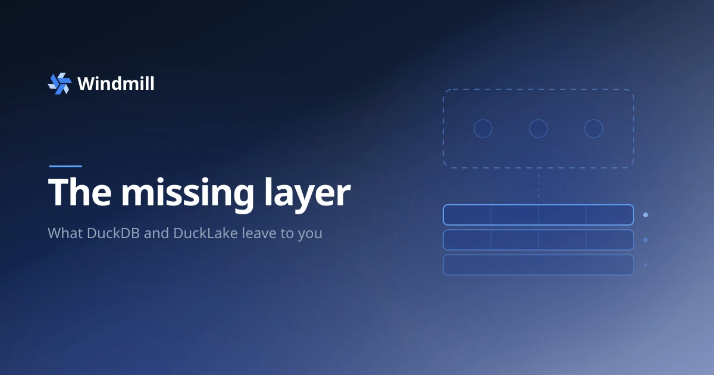

import DocCard from '@site/src/components/DocCard';

# The missing DuckDB and DuckLake orchestrator



DuckDB runs analytical SQL in-process. You write a
`SELECT`, it runs in milliseconds over Parquet, and the whole engine is a single
binary with no cluster to babysit. [DuckLake](/docs/core_concepts/persistent_storage/ducklake)
then gives that engine a real table format: a catalog database over Parquet files
in object storage, with ACID transactions, snapshots, partitioning and schema
evolution. Together they are most of a data warehouse that runs on a laptop.{/* truncate */}

But there is a gap between a DuckDB script that runs in your notebook and one that
runs in production. The script that computes `orders_daily` is the easy part.
Making it run every hour, backfill last month when you find a bug, skip the
partitions that already succeeded, tell you which downstream tables break if you
rename a column, and fail loudly when an upstream schema shifts, that is the part
neither DuckDB nor DuckLake sets out to do. DuckDB is the engine. DuckLake is the
format. Neither one is an orchestrator.

This post is about that missing layer, and specifically about how much smaller it
turns out to be once DuckLake is doing the hard storage work underneath. We built
it as [Windmill pipelines](/docs/core_concepts/pipelines), so read this as a
partisan argument, but we have tried to keep every claim concrete.


## What DuckLake gives you, and where it stops

Before building anything on top of DuckLake, be exact about what the
format already handles, because that's what decides how much orchestrator you
actually have to write.

DuckLake is a lakehouse format: a catalog database (Postgres, in Windmill's case)
that tracks Parquet files in object storage. At the storage layer it gives you
four things that normally cost real engineering:

| Capability | DuckLake |
| --- | --- |
| ACID multi-statement transactions | yes |
| A snapshot per commit, with time-travel (`AT (VERSION => n)`) | yes |
| Physical partitioning and pruning (`SET PARTITIONED BY (…)`) | yes |
| Schema evolution tracked in the catalog | yes |

Transactions mean a write either lands whole or not at all.
Snapshots mean every past version of a table is still there to read. Partitioning
means you can rewrite one slice without touching the rest. Schema evolution means
adding a column doesn't rewrite history.

Now the other half, the things DuckLake very deliberately does *not* do, because
they aren't a storage format's job:

- Nothing runs your script on a schedule, or when new data lands.
- Nothing decides which slice of the source to process, or remembers which slices
  are already done.
- Nothing wraps your `SELECT` into an incremental, idempotent write.
- Nothing knows that `orders_daily` reads from `orders_raw`, let alone which
  columns flow where.
- Nothing checks the data after a write, or warns a downstream query that its
  input just lost a column.
- Nothing keeps your dev iterations from writing to the production tables.

That list is the specification for the missing orchestrator, and it is what
Windmill pipelines implement. Each item turns out smaller than it looks, because
DuckLake already did the heavy lifting.

## `materialize`: a thin wrapper, because the substrate does the work

Start with the write. You have a DuckDB `SELECT` that computes a table. In Windmill
you put it in a script, add one comment, and it becomes a managed DuckLake table:

```sql
// pipeline
// materialize ducklake://main/orders_daily key=order_id
// partitioned daily

ATTACH 'ducklake://main' AS dl;
SELECT order_id, amount, created_at
FROM dl.orders
WHERE wm_partition(created_at) = {partition}
```

You write the query for one slice. Windmill owns the write. The contract is strict:
the script is setup statements (`ATTACH`, `SET`,
`CREATE TEMP …`) followed by exactly one trailing `SELECT`. Anything else is
rejected when you deploy, with a pointer to a `manual` escape hatch for the cases
that don't fit. That strictness is what lets everything downstream (lineage,
tests, schema capture) trust that it knows what the script produces.

Here is what `materialize` expands that one `SELECT` into, roughly, for a
partitioned replace:

```sql
-- first run only: bootstrap the table with the right schema plus a partition column
CREATE TABLE IF NOT EXISTS dl.orders_daily AS
  SELECT *, CAST(NULL AS VARCHAR) AS _wm_partition FROM (<user_select>) WHERE false;
ALTER TABLE dl.orders_daily SET PARTITIONED BY (_wm_partition);

-- every run: reconcile exactly this slice, in a transaction Windmill controls
BEGIN TRANSACTION;
DELETE FROM dl.orders_daily WHERE _wm_partition = '2026-06-19';
INSERT INTO dl.orders_daily SELECT *, '2026-06-19' AS _wm_partition FROM (<user_select>);
COMMIT;
```

There is no merge engine, no dialect matrix, no bespoke
upsert logic. It's a DELETE of one partition followed by an INSERT, inside a
transaction, and the reason it can be that small is that DuckLake already provides
the transaction, the partition, and the atomic file rewrite. The `_wm_partition`
column is the one piece Windmill adds: it turns "which slice" from an orchestration
idea into a physical storage layout, so the DELETE rewrites only that partition's
Parquet files and reads prune to it.

(It's DELETE-then-INSERT rather than `MERGE INTO` on purpose. DuckLake currently
can't reliably MERGE into a freshly-created partition, so every strategy is shaped
as delete-and-insert. That's the kind of substrate detail that lives in exactly
one place here.)

The write strategy and the slice unit are two independent choices, and they
compose:

| | replace (default) | `key=<col>` (merge) | `append` |
| --- | --- | --- | --- |
| **`// partitioned`** | replace the partition | upsert within the partition | append to the partition |
| **whole table** (no `// partitioned`) | `CREATE OR REPLACE TABLE` | upsert the whole table | append to the whole table |

Replace makes the slice exactly what the SELECT returned. `key=<col>` upserts
within the slice. `append` is insert-only for immutable logs. Whole-table replace
is a single `CREATE OR REPLACE TABLE … AS <your select>`, so changing the SELECT's
columns between runs just works, with no schema knob to set.

After the write, Windmill runs one extra read that doubles as the job result and
as a row it stores: `(asset, partition, snapshot_id, row_count, job_id, time)`,
written to a `materialized_partition` table. One round-trip, no new infrastructure,
and that single table ends up driving four different things in the sections below.

<DocCard
	title="Materialization reference"
	description="Managed DuckLake writes: replace / merge / append strategies, the managed-vs-manual contract, schema capture, and what a run returns."
	href="/docs/core_concepts/pipelines/materialization"
/>

## Partitions and backfill, mostly for free

Once a run processes one partition, most of what you'd expect an incremental engine
to give you falls out of the partition itself:

- **Unit of work** - one partition per run.
- **Idempotency** - DELETE-that-partition then INSERT is safe to repeat by
  construction.
- **State** - the `materialized_partition` table: which partitions exist, which are
  missing, which failed.
- **Backfill** - re-run a range. Each partition is one independent, idempotent run,
  and the range picker previews every partition's status and, by default, only
  runs the missing and failed ones. Backfilling a *range* is an
  [Enterprise Edition](/pricing) feature; running a single partition with an
  explicit `partition` argument is in the community edition.
- **No first-run special case** - every run is "process partition P". There is no
  "empty table versus existing table" branch to reason about.


The subtle part of any partitioned system is where the partition value comes
from. Windmill resolves it once, at the top of a chain, and carries it
down every downstream step of the same run, so a whole cascade stays on one
partition even if it crosses midnight. An explicit `partition` argument (from a
manual run, a backfill, or an upstream step) is used as-is and never re-derived,
which is exactly what makes backfill and retry correct: retrying a failed step
reprocesses that run's partition instead of drifting to "now".

One sharp edge is handled for you. The `{partition}` token expands to an identity
string (`'2026-06-19'` daily, but `'2026-W25'`, `'2026-06'`, `'2026-06-19T23'` at
other grains), and only the daily form is a valid timestamp literal. So a
hand-written `WHERE ts = TIMESTAMP {partition}` works on daily and breaks the
moment someone switches to hourly. Windmill injects a `wm_partition(ts)` macro so
`WHERE wm_partition(created_at) = {partition}` filters to the active slice on any
grain, using the same format the resolver used, so the two can't drift apart.

<DocCard
	title="Partitioned pipelines"
	description="Partition kinds, timezone/format/start options, the partition token, resolution precedence, and range backfill."
	href="/docs/core_concepts/pipelines/partitioning"
/>

## Lineage from the SQL you already wrote

Because the `materialize` contract guarantees Windmill knows the produced table and
the tables it reads, it can build the asset graph with no extra declaration: a
DuckLake or S3 write is a produced node, and a read of another managed table is an
edge. The script that produces `clean/events` runs when `raw/events` lands,
inferred straight from the `FROM` clause.

Column-level lineage comes from the same parse. Windmill walks each output query's
projection and maps every output column back to the source columns its expression
reads, computed columns included:

```sql
// pipeline
// materialize ducklake://warehouse/orders_enriched

ATTACH 'ducklake://warehouse' AS dl;
SELECT order_id,
       amount + tax AS order_total   -- records BOTH amount and tax as sources of order_total
FROM dl.orders
```

No annotation is needed in the common case. When inference can't reach a mapping (a
Python or TypeScript step with no SQL AST, or dynamic SQL), you spell it out with
`// column <out> <- <asset>.<col>`, and the annotation wins. The same parser runs
in two places that agree: compiled to WASM in the editor against your open buffer,
and server-side on deploy. Select a column and you get its full upstream and
downstream set across every script in the graph, which is the "what breaks if I
rename this" question answered from parsed SQL.


<DocCard
	title="Column-level lineage"
	description="SQL-AST inference for DuckDB, the // column override for polyglot/dynamic SQL, and the transitive impact trace."
	href="/docs/core_concepts/pipelines/materialization#column-level-lineage"
/>

## Tests and schema contracts against the slice you just wrote

A data test in Windmill is a comment:

```sql
// data_test not_null order_id
// data_test unique order_id
// data_test accepted_values status = paid,pending,refunded
// data_test relationships customer_id -> ducklake://main/customers.id
```

Each one compiles to a violating-row count, and all of them are folded into a
single pass over the freshly-materialized slice rather than run one query at a
time. Any violation fails the run and propagates up the cascade like any other
failure, and the error carries a sample of the offending rows, so you learn which
orders had a null `order_id`, not just how many. For a partitioned table the checks
scope to the slice just written, so backfilling one partition doesn't re-test the
others. Like the rest of the annotation family, tests are validated at deploy, not
first discovered at 2am.

By default the write commits and then the tests run, so a failure fails the run but
leaves the snapshot readable for you to inspect (time-travel makes that easy). On
[Enterprise Edition](/pricing) it flips to write-audit-publish: the tests run
inside the write transaction and a violation rolls the whole thing back, so readers
never see a bad version.

Schema is captured on every run too, versioned so a new entry appears only when the
column set actually changes. That captured schema is the contract: saving a query
that reads a managed table checks its column references against the producer's real
schema and warns you in the editor if you reference a column an upstream reshape
removed.

<DocCard
	title="Data tests"
	description="unique / not_null / accepted_values / relationships / custom, run against the materialized slice and propagated through the cascade."
	href="/docs/core_concepts/pipelines/materialization#data-tests"
/>

## Time-travel and history, because every write is a commit

Every managed write is a DuckLake commit, and every run records the snapshot it
produced. So reading a table as it was is just:

```sql
FROM dl.orders_daily AT (VERSION => 42)
```

You get the three things people actually reach for, debugging ("what did this look
like at the run that failed"), rollback (re-materialize a consumer from an old
snapshot), and ad-hoc "what changed", for the price of storing one integer per run.
Cascaded runs also record the snapshot ids of their inputs, so for any slice you
can answer which exact version of each upstream produced it, which is effectively a
lockfile for data.


History keyed by business time rather than by commit is a different question: not
"what did the table look like at snapshot N" but "which version of this customer
was current when that order was placed". Adding `history` to a keyed materialize
turns it into a managed type-2 slowly changing dimension:

```sql
// pipeline
// materialize ducklake://analytics/dim_customer key=id history track=name,tier

SELECT id, name, tier   -- current state, one row per key
FROM dl.stg_customers
```

You write the current state, one row per key. The runtime manages `valid_from`,
`valid_to` and `is_current`, closing the old version and opening a new one whenever
a tracked column changes, and writing zero rows when nothing changed. The payoff is
the effective-dated as-of join, the dimension version that was current at each
fact's timestamp:

```sql
SELECT o.order_id, o.amount, d.tier AS tier_at_order_time
FROM dl.stg_orders o
ASOF JOIN dl.dim_customer d
  ON o.customer_id = d.id AND o.ordered_at >= d.valid_from
```

<DocCard
	title="SCD2 history"
	description="The managed history strategy: valid_from/valid_to/is_current, tracked columns, soft vs hard deletes, the _current view, and the as-of join."
	href="/docs/core_concepts/pipelines/materialization#scd2-history-slowly-changing-dimensions"
/>

## Reuse without a templating language

Shared logic in DuckDB is a `CREATE MACRO`, and Windmill leans on that directly
instead of inventing a template layer on top of SQL. A script annotated `// macros`
is a library:

```sql
// macros
CREATE OR REPLACE MACRO safe_div(a, b, fallback := 0) AS
  CASE WHEN b = 0 THEN fallback ELSE a / b END;
CREATE OR REPLACE MACRO pct(part, total) AS round(100 * safe_div(part, total), 2);
```

Deploying is publishing. Every DuckDB script in the workspace can call `pct(…)` the
moment the deploy lands, with no import and no annotation. At run time the worker
sees the calls, pulls in their transitive dependencies (`pct` needs `safe_div`),
and injects the macro definitions ahead of your statements. Because these are real
DuckDB macros and not text substitution, they autocomplete, they're bind-checked
when defined, and they can't produce the "the template rendered but the SQL is
invalid" failure that string templating is prone to. Redeploy the library and the
next run of every consumer picks up the new definition; define a macro of the same
name locally and the local one wins.

<DocCard
	title="Macro libraries"
	description="Engine-native DuckDB CREATE MACRO libraries: authoring, lexical call detection, transitive injection, late binding, the // use escape hatch, and the trust model."
	href="/docs/core_concepts/pipelines/macros"
/>

## One DAG: schedules, events, freshness, and the non-SQL parts

None of this is SQL-only. A pipeline step runs when any of its triggers fire, and
triggers are just nodes on the graph: an upstream asset write (the cascade), a
[schedule](/docs/core_concepts/scheduling), or a webhook, Kafka, NATS, Postgres,
SQS and the rest.

```ts
// pipeline
// on schedule
// on kafka
```

Which means `Kafka → Python normalize → DuckDB aggregate → Postgres view → Slack
notify` is one pipeline, on your own workers, under one permission model. The
DuckDB transform is the core, and the Python ingest and the Slack call live in the
same graph rather than in a separate system wired to it. A `// freshness 2h`
annotation puts a fresh/stale verdict on a node, and on
[Enterprise Edition](/pricing) a watchdog re-runs a stale script as a backstop. And
[selective execution](/docs/core_concepts/pipelines#selective-execution-run-up-to-here)
gives you the "run this node and everything downstream" and "run everything up to
this node" gestures without a separate node-selection grammar.


## The local loop, and keeping dev data out of prod

DuckDB users iterate locally, so the loop matters. The [CLI](/docs/advanced/cli)
runs the same edit, preview and run cycle as the UI, built from the same WASM
parser, so the graph you see locally is the graph that deploys:

```bash
wmill pipeline dev  <folder>              # watch the folder, live-preview the graph
wmill pipeline run  <folder> --local      # run the whole pipeline, no deploy
wmill pipeline run  <folder> --to clean --partition 2026-06-30   # bounded, headless backfill
```

`pipeline dev` watches the folder and pushes the rebuilt graph to a live browser
page on every save, so you can edit in your own tools and watch the canvas update.
`run --local` executes each node as a preview in topological order without
deploying.

Dev data is the part that's easy to get wrong, and the answer is a
[workspace fork](/docs/advanced/workspace_forks#fork-data-environments-for-ducklake):
an isolated data environment per lake. Materializing inside a fork writes to a
fork-scoped schema and bucket prefix using the same `ducklake://` URIs and
unchanged annotations, while tables the fork hasn't built yet are read from the
parent through read-only defer views. So you can iterate on a single node against
real upstream data, without rebuilding everything, and without a dev run ever
writing to production.


## When single-node DuckDB is the right call, and when it isn't

The bet underneath all of this is that a single large box running DuckDB
[covers the large majority of ETL workloads](/docs/core_concepts/data_pipelines),
and it does. An enormous number of pipelines that today run on a distributed
cluster would fit comfortably in DuckDB's memory on one machine. That's the case
this is built for: your data lives in object storage as Parquet, and you want fast,
cheap, reproducible transforms over it on compute you control.

It's the wrong tool when your data already lives as petabytes inside Snowflake or
BigQuery and the elastic warehouse compute is the whole point. Pulling that data
out to process it on a single node would be a mistake, keep it where it is. This is
for the very large space of workloads where the data is (or can be) in your own
object storage and single-node OLAP is plenty.

There is also no need to choose. If you already have a dbt project, nothing here
asks you to port it: Windmill runs an unmodified dbt project as a script, with its
models on the same asset graph. Keep dbt where it is, reach for pipelines on
greenfield work, and see the [dbt quickstart](/docs/getting_started/scripts_quickstart/dbt)
for that path.

And to be straight about maturity: pipelines are in alpha. The model is, we think,
the right shape, but it hasn't had years of production hardening, and there is no
third-party package registry yet. For some teams that matters more than the shape
of the model does.

## DuckDB gave us the engine, DuckLake gave us the format

Building this, most of the orchestrator turned out to be unnecessary. The
transaction, the snapshot, the partition rewrite, the schema
history: all the machinery you'd expect to write for managed, incremental,
versioned tables is already in the storage layer. What's left on top is thin: a
write-strategy wrapper, a partition resolver, a SQL parser that's read twice, and a
cascade engine. The orchestrator DuckDB and DuckLake were missing turns out to be
small, because they did the hard part first.

Pipelines are in alpha, and the entry point is deliberately tucked away, create one
from the home page via the dropdown next to **+ Flow**. Feedback very welcome on
[Discord](https://discord.com/invite/V7PM2YHsPB) or
[GitHub](https://github.com/windmill-labs/windmill).

If you're coming at this from the dbt and Dagster side instead, we told the same
story from that angle, as a five-part series starting here:

<DocCard
	title="How dbt works, and why orchestrators shouldn't split it into tasks"
	description="A five-part series on data pipelines: how dbt is actually orchestrated, why lineage breaks between tools, incremental models against partitions, what the Rust rewrite is for, and why data tests run too late."
	href="/blog/how-dbt-works-and-its-orchestrators"
/>

<div className="grid grid-cols-2 gap-6 mb-4">
	<DocCard
		title="Pipelines reference"
		description="Every annotation and option with examples: triggers, partitions, materialization, column lineage, data tests, joins."
		href="/docs/core_concepts/pipelines"
	/>
	<DocCard
		title="Pipelines quickstart"
		description="Build your first asset-wired pipeline in about five minutes."
		href="/docs/getting_started/pipeline_quickstart"
	/>
	<DocCard
		title="Data pipelines on Windmill"
		description="The product overview: the DuckDB and DuckLake data-pipeline feature set, integrations and benchmarks at a glance."
		href="/use-cases/data-pipelines"
	/>
	<DocCard
		title="ETL & data processing"
		description="The processing side: S3 streaming, Polars and DuckDB, SQL-to-S3, and the benchmarks behind single-node compute."
		href="/docs/core_concepts/data_pipelines"
	/>
</div>
