# SAML & SCIM

Setting up SAML and SCIM allows you to authenticate users using your identity provider.

This feature is available under [Enterprise Edition](/pricing). Configuration is set from [Instance settings](../../advanced/18_instance_settings/index.mdx#scimsaml)

## SAML

The entity ID is `windmill`

ACS Url is `<instance_url>/api/saml/acs`
SCIM connector is `<instance_url>/api/scim`
Application username format is `Email`

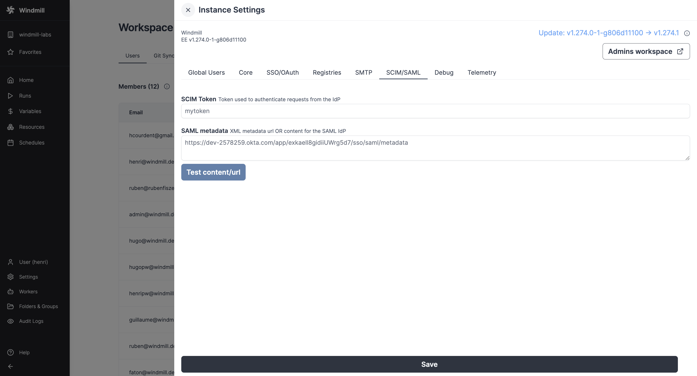

In the Instance settings UI, pass the SAML Metadata URL (or content) containing the metadata URL (or XML content).

:::tip

You can control the entity ID using the `SAML_AUDIENCE` environment variable. This can be useful if you want to use the same identity provider for multiple instances (e.g dev / prod).

:::

### Private or internal IdP metadata URLs

By default, Windmill blocks SAML metadata URLs that resolve to private or internal network addresses to protect against [server-side request forgery (SSRF)](https://owasp.org/www-community/attacks/Server_Side_Request_Forgery). If your identity provider is only reachable on a private IP with no public DNS, the server rejects the metadata URL at load time and fails to start.

To allow private metadata URLs, set the `ALLOW_PRIVATE_SAML_METADATA_URLS=true` environment variable on the server. Only enable it when the metadata URL points to an identity provider you trust.

Alternatively, if you cannot expose the IdP metadata over a URL, paste the XML content directly in the field instead of a URL. Content passed inline is not subject to the SSRF check.

### Okta

Configure Okta with the following settings (and replace cf.wimill.xyz with your domain):

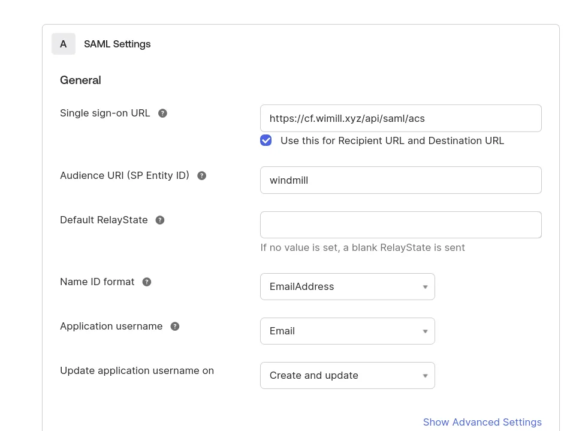

In the Instance settings UI, pass the SAML Metadata URL (or content) containing the metadata URL (or XML content).

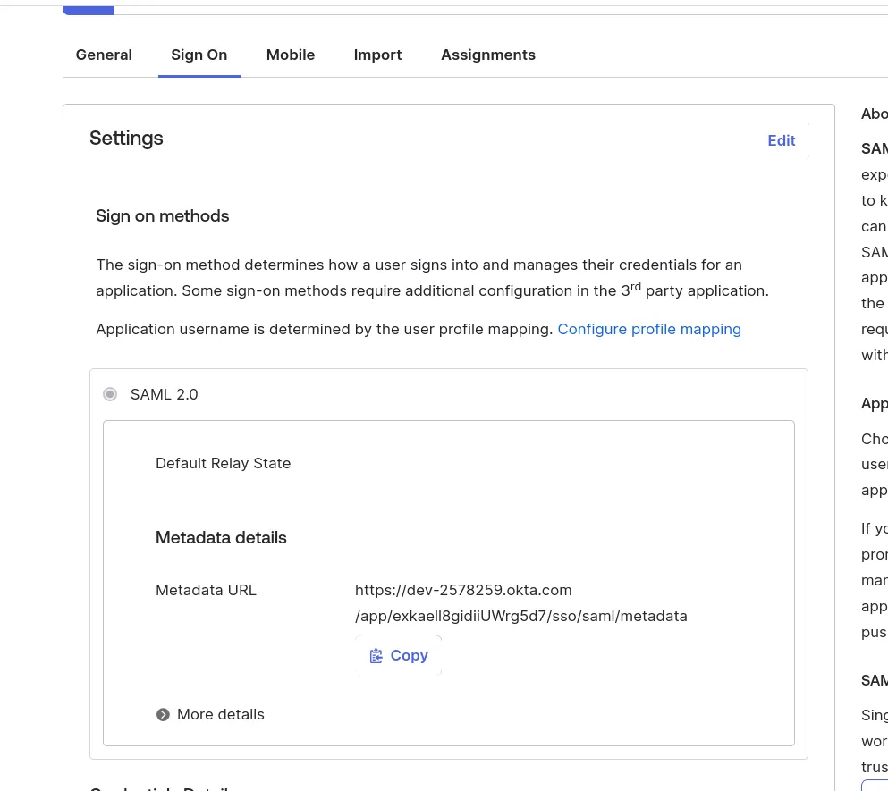

### Microsoft Entra (Azure)

In the Azure portal, go to "Enterprise Applications" and create a new one of type "Non-gallery".

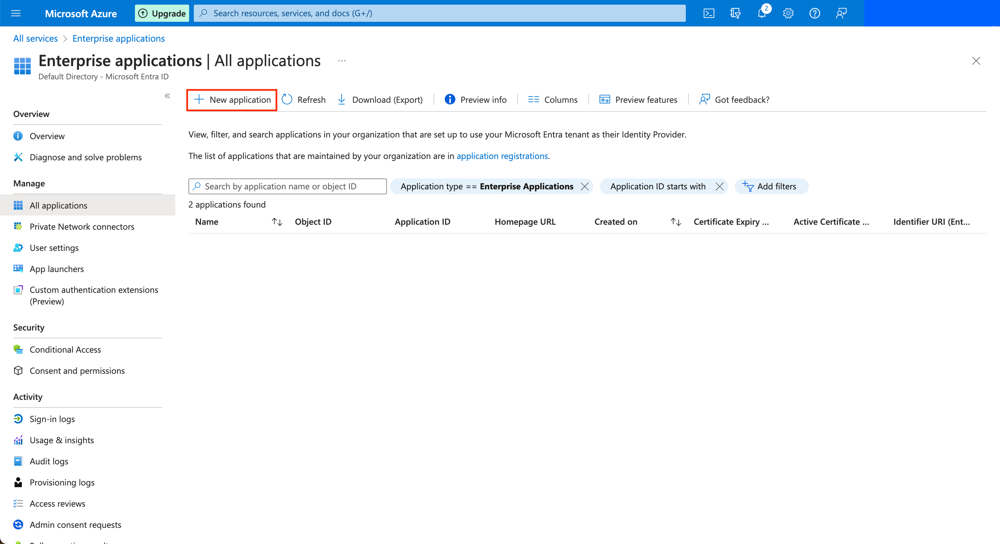

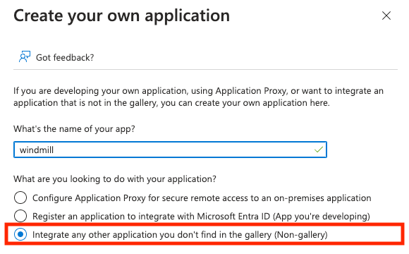

Once the application is created, in the application's page go to "Single sign-on" on the left menu, and click on the "SAML" button.

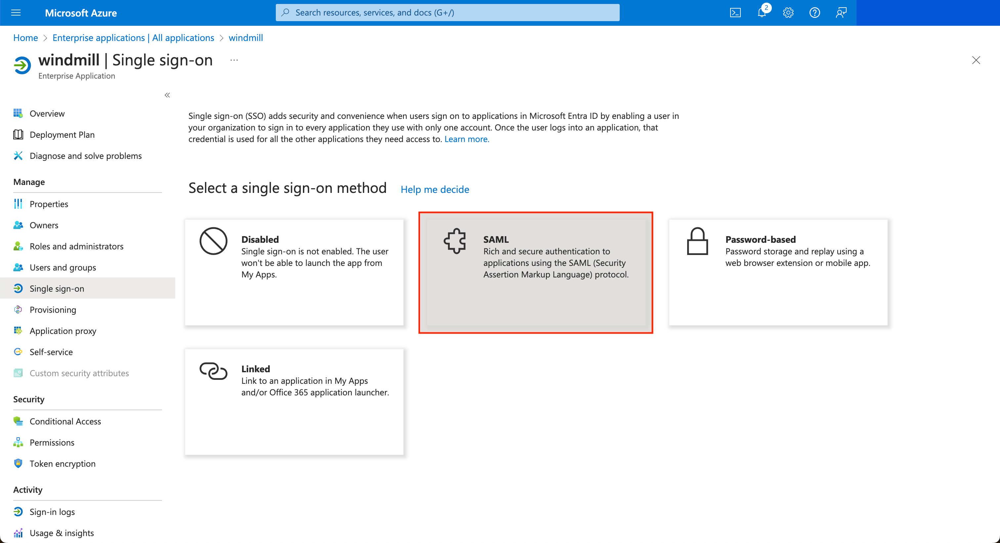

Edit the configuration to set the Entity ID to `windmill` and the ACS url to `<instance_url>/api/saml/acs`.

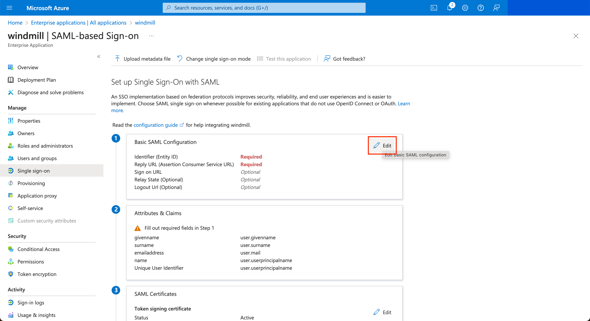

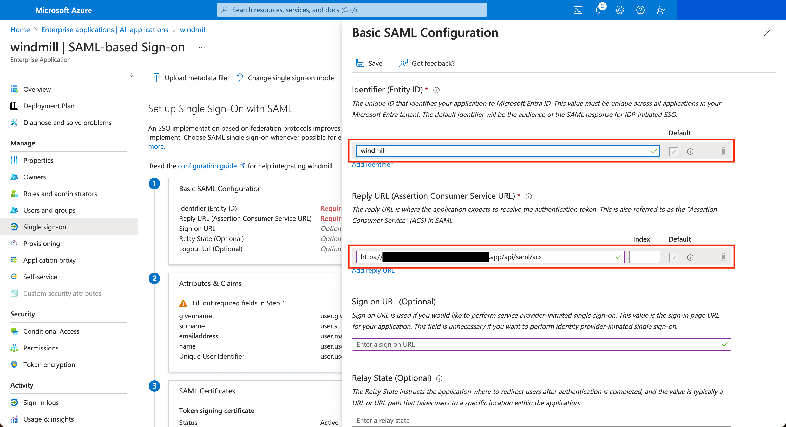

#### Configuring the NameID claim

For SAML authentication to work correctly with Entra, you need to configure the primary NameIdentifier claim. In the "Attributes & Claims" section of your SAML configuration:

1. Click on the NameIdentifier claim to edit it
2. Set the following values:
   - **Name identifier format**: Email address
   - **Source attribute**: `user.mail`

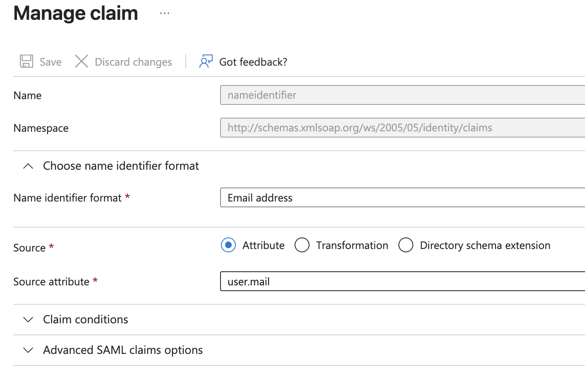

#### Configuring the groups claim

Optional, only needed for [login-time group sync](#login-time-group-sync-from-the-idp-groups-claim).
In the "Attributes & Claims" section, click "Add a group claim" and keep "Group ID" as the source attribute.
Entra then emits the claim `http://schemas.microsoft.com/ws/2008/06/identity/claims/groups` with the groups' object ids, which is the same value SCIM stores as the instance groups' external id.

The claim must cover every group SCIM provisions, because a login whose claim names at least one group removes the user from every SCIM-provisioned group the claim does not name.
Choose "Groups assigned to the application" when provisioning is scoped to assigned users and groups (see [SCIM with Entra](#microsoft-entra-azure-1)); this also keeps the claim below the 150-group limit past which Entra omits it.
Choose "Security groups" or "All groups" when provisioning syncs all users and groups.
An omitted claim is harmless either way: the login then changes nothing.

{/* Screenshot placeholder: the Entra "Group Claims" panel with "Groups assigned to the application" selected and "Group ID" as the source attribute. */}

#### Configuring Windmill with the metadata URL

Once the SAML configuration is complete in Entra, copy the App Federation Metadata URL from the SAML Certificates section:

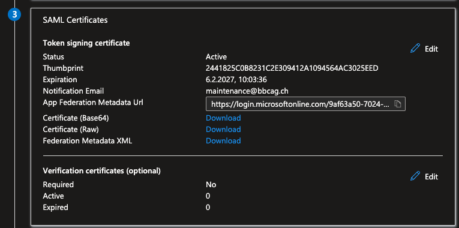

Paste this URL in the Windmill Instance settings UI.

If for some reasons, the metadata URL cannot be used, you can copy the XML content and paste it in the field instead.

Once it's saved, you can test the login by clicking on the `Test` button at the bottom, then on the drawer `Test sign in`.

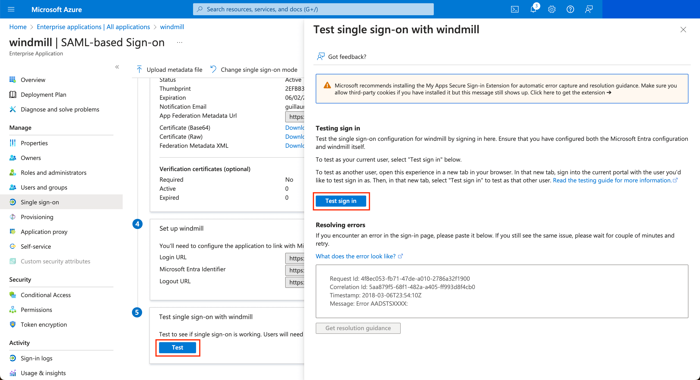

## SCIM

### Okta

Configure Okta with the following settings (and replace cf.wimill.xyz with your domain):

:::warning
The `/api/scim` endpoint of your windmill instance needs to be exposed to the internet for Okta to push groups/users to your windmill instance.
:::

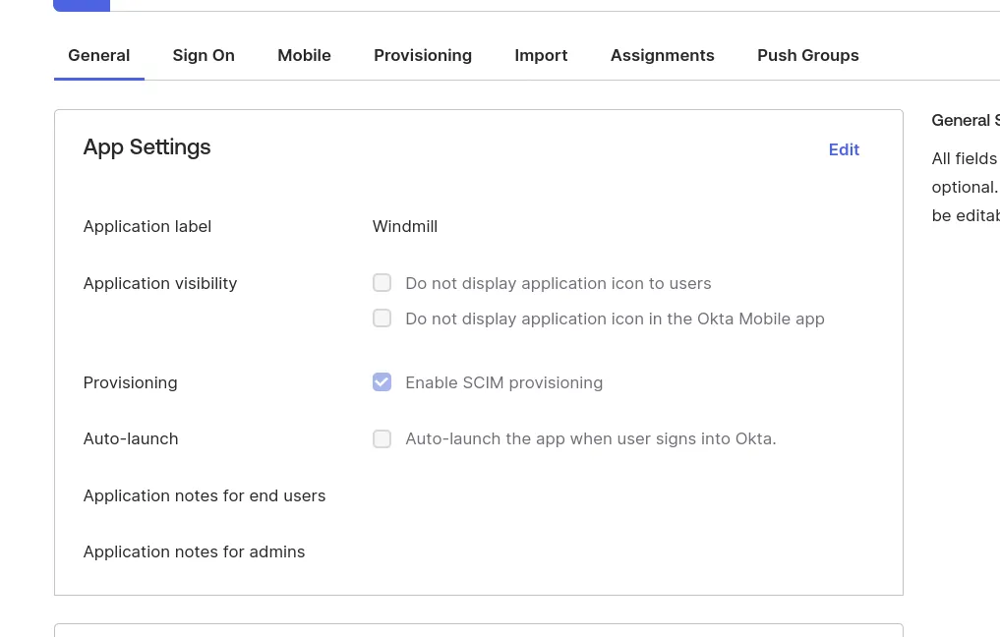

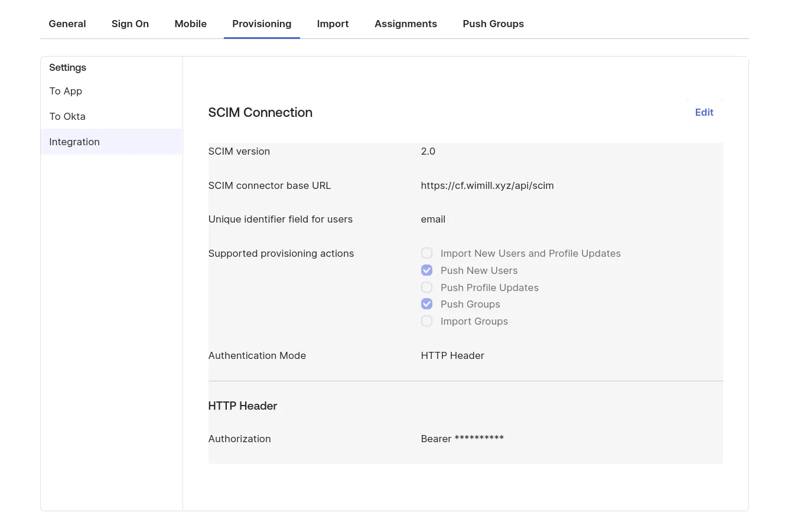

In the Instance settings UI, choose a random secure string as a SCIM token that you will set in the Okta SCIM connection setting's "Authentication Mode -> HTTP Header".

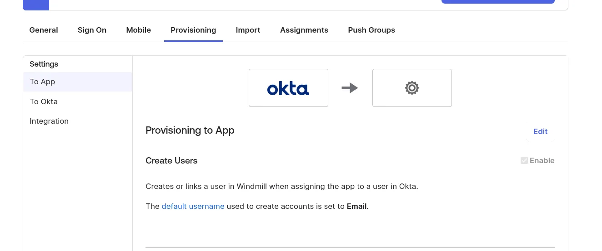

<video
className="border-2 rounded-xl object-cover w-full h-full"
controls
muted
src="/videos/okta_scim.mp4"
/>

### Microsoft Entra (Azure)

Create an application from the "Enterprise Applications" menu (see [Configuring SAML with Microsoft Entra](#microsoft-entra-azure)). Once the application is created, in the application's page go to "Provisioning" on the left menu, and click on the "Get started" button.

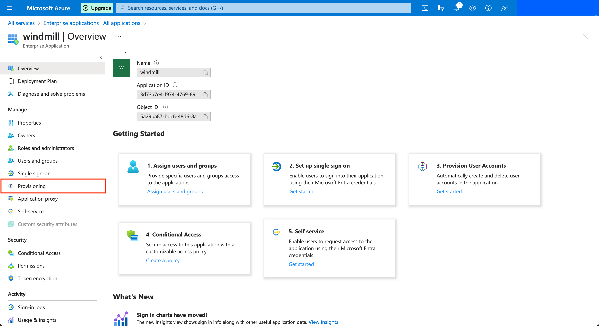

Choose the "Automatic" provisioning mode, and then for the Tenant URL, input the public URL of your Windmill server with the prefix `/api/scim`.

Copy the App Federation Metadata URL and paste it in the Instance settings UI.

In the Instance settings UI, set the SCIM token containing the secret value that you will share to Azure. You can click "Test" in Windmill's Instance settings UI to validate the SAML metadata URL/Content.

You can then click on the Test Connection button to validate Azure can connect to Windmill's SCIM endpoint. You can then choose to sync only the Users and Groups assigned to this application, or all users and groups. Note that if you choose the former, after you save, go to the application's page and click on the "Users and groups" button in the left menu bar. Only the users and groups present here will be synced to Windmill.

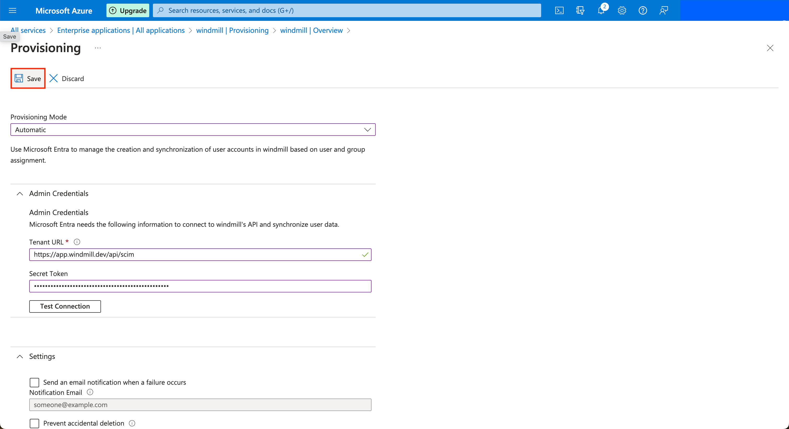

Once this is done, you can click on the Save button at the top left. Azure will now synchronize users and groups approximately every 40 minutes.

### In Windmill

Once setup, the groups page should contain a new section:

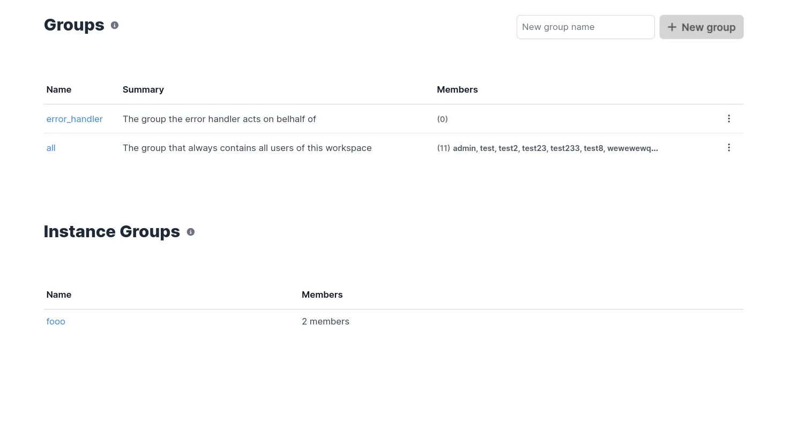

## User deprovisioning

When your identity provider sends a SCIM PATCH request with `active: false` for a user, Windmill disables the user at the instance level rather than deleting them. Disabled users:

- Cannot log in or authenticate via any method
- Are excluded from on-behalf-of selectors and workspace menus (shown as "user disabled")
- Retain their workspace memberships and item ownership for auditability

When a user is re-enabled via SCIM (`active: true`), their access is restored.

A SAML metadata endpoint is also available at `GET /api/saml/metadata` for identity providers that require it during setup.

## Instance groups

When SCIM is properly configured, groups from your identity provider will be automatically synchronized to Windmill as **instance groups**. These are special groups that:

- Are automatically managed by your identity provider (no manual creation needed)
- Sync users and group memberships automatically
- Can be used across multiple workspaces within your instance
- Provide enterprise-level group management without manual provisioning

Instance groups appear in your Windmill groups interface with a special designation, and can be assigned permissions to folders and resources just like regular groups. This eliminates the need for manual group management while maintaining full integration with Windmill's permission system.

### Instance-level roles

Instance groups can be assigned an **instance-level role** (superadmin or devops) from the instance group editor. When set, all members of the group automatically receive that role. This allows you to manage instance-level access through your identity provider — for example, assigning devops access to an "infrastructure" group or superadmin access to a "platform-admins" group.

Role changes propagate automatically when:
- A user is added to or removed from the group via SCIM
- The group's instance role is changed
- The group is deleted

Manually elevated roles always take precedence — if a superadmin promotes a user manually, group changes won't demote them. For full precedence rules, see [Roles and Permissions](../../core_concepts/16_roles_and_permissions/index.mdx#instance-level-roles-via-instance-groups).

### Workspace auto-assignment

Instance groups can be automatically mapped to workspaces with specific role assignments. This powerful feature allows you to:

- **Automatically add users to workspaces** when they join an instance group via SCIM
- **Assign specific roles** (viewer, developer, admin) to instance group members per workspace
- **Manage multiple instance groups** per workspace with different role configurations
- **Track user origin** to distinguish between manually added users and those added via instance groups

This mapping is configured in the [workspace settings](../../core_concepts/44_workspace_settings/index.mdx) under "User Management" where you can:

1. Select which instance groups should automatically add users to the workspace
2. Define the role each instance group's members should receive
3. View and manage existing auto-assignments

When a user is added to an instance group in your identity provider, they will automatically gain access to all configured workspaces with their assigned roles. Similarly, when users are deleted from the group in the SCIM source, this will automatically propagate to remove them from all mapped workspaces, ensuring consistent access management across your organization.

For more details about how to use instance groups within your workflows and permission structure, see [Groups and folders](../../core_concepts/8_groups_and_folders/index.mdx#instance-groups).

### Login-time group sync from the IdP groups claim

SCIM is push-based: a group change in the identity provider reaches Windmill on the provider's next provisioning cycle, about 40 minutes on Entra.
For access that has to land faster, such as a break-glass group that grants superadmin, Windmill can also read the groups claim of every SAML or OIDC login and reconcile the user's instance group membership before the session starts.
This is available under Enterprise Edition and is off unless the setting below is set.

#### How it works

- Only SCIM-provisioned instance groups take part: those whose external id was set by SCIM with the identity provider's group id. Groups created by hand in Windmill are never touched.
- Claim values are matched against that external id only, so the claim must carry group ids rather than display names. On Entra, SCIM and the groups claim both use the group object id by default.
- Groups named in the claim are added and SCIM-provisioned groups not named are removed, then the [instance-level role](#instance-level-roles) and the [workspace auto-assignment](#workspace-auto-assignment) are re-derived, all before the session token is created. The claim must therefore cover every group SCIM provisions. A manually granted superadmin or devops role is never revoked.
- A login whose claim is absent or empty changes nothing and logs a warning. Removal only happens when the claim carries at least one value; otherwise revocation is left to SCIM and session expiry. This protects against a wrong attribute name, and against Entra omitting the claim when a user is in no application-assigned group or in more than 150 groups.
- Changes apply at the user's next login, not mid-session. A role change also ends the user's other sessions.
- The setting applies to every SSO client on the instance. A provider that does not send the claim only logs the warning.

#### Enabling it

1. Have your identity provider emit the groups claim with group ids. On Entra, see [configuring the groups claim](#configuring-the-groups-claim).
2. In the [instance settings](../18_instance_settings/index.mdx#sso-groups-claim), in the "Auth/OAuth/SAML" section under the SSO tab, set "SSO groups claim" to the attribute name: `http://schemas.microsoft.com/ws/2008/06/identity/claims/groups` for Entra SAML, or the userinfo key (usually `groups`) for an OIDC provider. Leave it empty to turn the feature off.
3. Give the groups their privileges: an instance-level role from the instance group editor, or a workspace role from the workspace's user management settings.
4. Test with one user: add them to the group in the identity provider, log in, then remove them and log in again. Grants and removals made at login appear in the [audit logs](../../core_concepts/14_audit_logs/index.mdx) with the "Instance" scope, recorded by the `sso` user under the operations `instance_groups.jit_adduser` and `instance_groups.jit_removeuser`.
