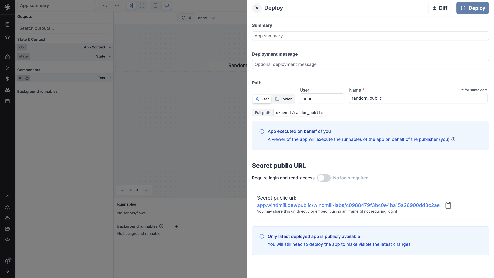
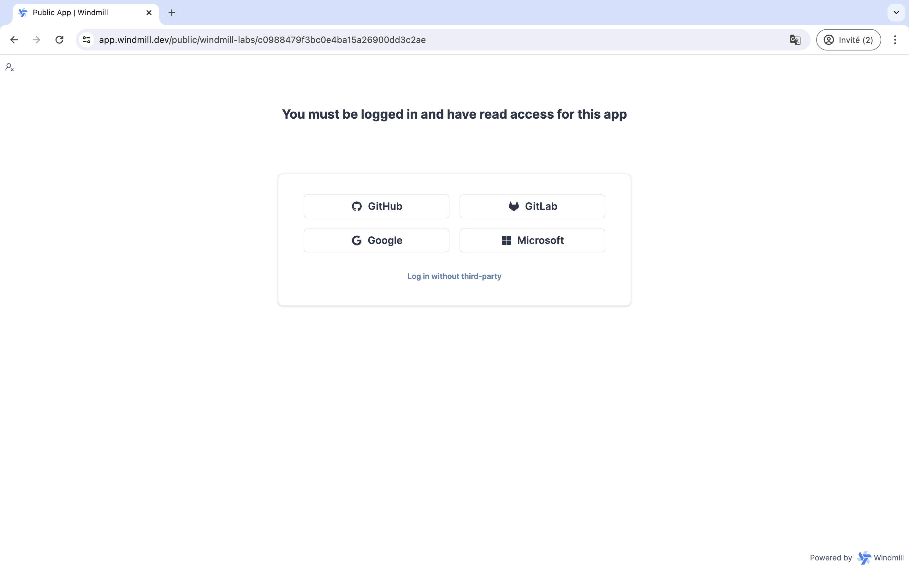
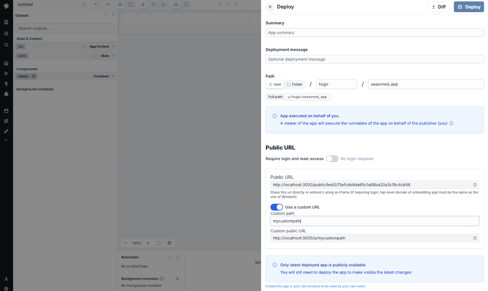

import DocCard from '@site/src/components/DocCard';

# Public apps

Windmill apps are custom-made user interfaces meant to interact with scripts and flows. This applies to both [low-code apps](./0_app_editor/index.mdx) and [full-code apps](../full_code_apps/index.mdx).

By default, [deployed](./0_toolbar.mdx#deploy) apps are [accessible to](../core_concepts/16_roles_and_permissions/index.mdx) all users that belong to the [folder](../core_concepts/8_groups_and_folders/index.mdx) the app was deployed to.

A "Public" app is an app that can be seen and used by users outside this scope (i.e.) folder.

When deployed, an app automatically has a secret public URL.

Who the URL lets in is set from the Access control in the Deploy menu of the app editor:

- Members: workspace members with [read access](../core_concepts/16_roles_and_permissions/index.mdx) on the app. This is the default, and a visitor who is not one is asked to log in.
- Guests: the above, plus anyone with no Windmill account whom your identity provider authenticates or a [guest JWT](./13_guest_apps/index.mdx#guest-jwt-for-embedded-apps) names. They join no workspace and take no seat. See [guest apps](./13_guest_apps/index.mdx).
- Public: anyone holding the secret URL, with no login at all.

Widening an app to Guests or to Public can be reserved to workspace admins and bypass users with a [protection ruleset](../core_concepts/56_protection_rulesets/index.mdx).

A public app runs in the browsers of people who may not be workspace members, and by default its code runs there with whatever Windmill session the viewer has.
We recommend turning on [sandbox isolation](../full_code_apps/8_sandbox_isolation/index.mdx) (alpha) for public apps, which confines that code to an opaque-origin iframe instead.

	<DocCard
		title="Guest apps"
		description="Let people open an app without a Windmill account and without a seat, through a sign-in or a JWT your backend signs."
		href="/docs/apps/guest_apps"
	/>
	<DocCard
		title="Sandbox isolation"
		description="Confine an app's browser-side code so it cannot reach the viewer's Windmill session."
		href="/docs/full_code_apps/sandbox_isolation"
	/>
	<DocCard
		title="Roles and permissions"
		description="Find out about the roles within a Windmill instance and their respective permissions."
		href="/docs/core_concepts/roles_and_permissions"
	/>

## Rate limiting

Users can limit the number of public (anonymous) app executions per minute per server. This is useful to prevent abuse of public apps that don't require login.

The setting is found under workspace settings > Advanced > Apps. Set the value to 0 or leave empty to disable rate limiting. This is a per-server limit, not a global limit.

Executions started by a [guest](./13_guest_apps/index.mdx) count against the same limit.

## Custom URL

[Cloud and enterprise](/pricing) users can also customize the public URL of their app. The app will be available at `https://mywindmill.com/a/<custom-path>`.

On cloud only, the custom path is prefixed by the workspace name.

