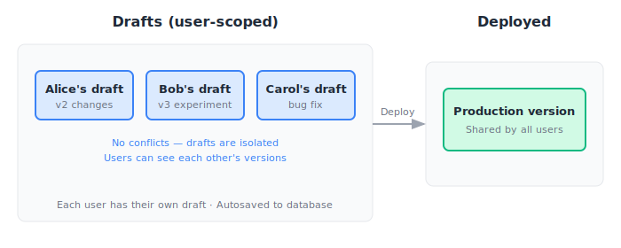
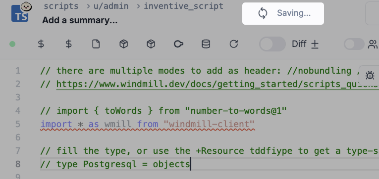
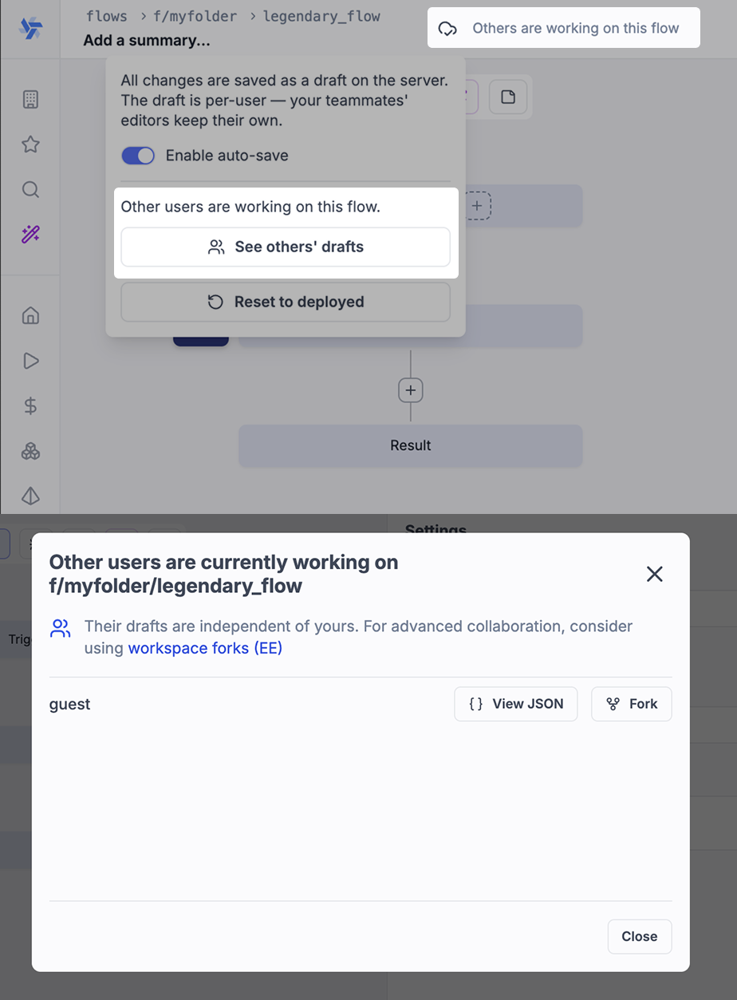
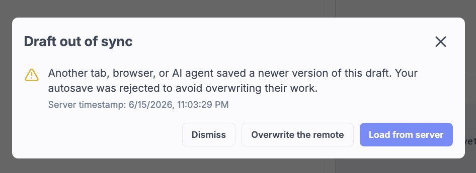

import DocCard from '@site/src/components/DocCard';

# Draft and deploy

Draft, test, and deploy scripts, flows, and apps in Windmill to iterate and save safely.

:::info Deploy to prod in Windmill

For all details on deployments to prod in Windmill, see [Deploy to prod](../../advanced/12_deploy_to_prod/index.mdx).

:::

Each script, flow, or app exists in two states: as a `draft` (work in progress) and as a `deployed` version (the authoritative, production-ready version). Drafts are user-scoped and automatically saved to the database as you edit.

Once deployed, scripts, flows and apps will be visible, editable and/or runnable by users [with the right permissions](../16_roles_and_permissions/index.mdx).

:::tip Deploy to prod

For all details on deployments to prod in Windmill, see [Deploy to prod](../../advanced/12_deploy_to_prod/index.mdx).

:::

## Draft

Drafts are user-scoped and automatically saved to the database whenever you make changes in the editor. The script, flow, app, and raw app editors all display an **Autosave indicator** that shows when your changes are being saved.

<!-- PLACEHOLDER: Replace with screenshot of the autosave indicator in the editor toolbar, showing the "Saving..." and "Saved" states -->

The autosave is intelligently debounced to avoid data loss while preventing excessive requests. Your work is continuously preserved without needing to manually click a save button.

Drafts can be run and tested only from the editor (script, flow, or app) with the `Test` button. The draft inherits the permissions of the item it is attached to, or the path permissions for drafts of items that have not yet been deployed.

### Legacy drafts

Previously, drafts were workspace-scoped (shared among all users in the workspace) and also had a local storage auto-save layer in the browser. Existing workspace-scoped drafts will appear as **"Legacy draft"** in the editor. You can continue working from a legacy draft or discard it in favor of the deployed version.

### Concurrent editing and user versions

When multiple users are working on the same item, you can see who else is currently editing it. Each user's draft is saved separately, allowing parallel work without overwriting each other's changes.

<!-- PLACEHOLDER: Replace with screenshot of the editor showing other users working on the same item, with a UI element indicating their presence -->

You can view another user's version as JSON or fork their version to start working from their changes. This basic synchronization mechanism helps resolve race conditions when multiple people work on the same item.

:::tip For true collaborative workflows

For teams that need real-time collaborative editing and structured workflows, we recommend using [Workspace Forks](/docs/advanced/workspace_forks), available in the [Enterprise Edition](/pricing).

	<DocCard
		title="Workspace forks"
		description="Create independent copies of workspaces for parallel development workflows."
		href="/docs/advanced/workspace_forks"
	/>

:::

### Conflict detection

Windmill includes basic conflict detection to prevent accidental overwrites:

- **Concurrent save detection**: If your autosave writes to the database but another browser tab or session has saved since your last save, you will be alerted.
- **Deployed version conflicts**: If you are editing an item from a draft and someone else deploys a new version of that item since you last saved, you will be prompted to choose whether to keep working on your draft or load the latest deployed version.

<!-- PLACEHOLDER: Replace with screenshot of the conflict detection dialog showing options to keep draft or load deployed version -->

### AI session drafts

[AI sessions](/docs/core_concepts/ai_generation) can create and edit drafts for workspace items including scripts, flows, apps, raw apps, resources, variables, and triggers. When an AI session modifies an item's draft, you will see the changes appear live in your editor.

This enables AI-assisted development workflows where you can guide the AI to make changes while watching the results in real-time.

## Deployed version

The deployed version is the authoritative version of a runnable. Once deployed, it is not only visible by workspace members [with the right permissions](../16_roles_and_permissions/index.mdx) but has its own [auto-generated UI](../6_auto_generated_uis/index.mdx), [webhooks](../4_webhooks/index.mdx), or can be called from flows and apps (for scripts and flows). This also means that local edits and drafts can be made in parallel to a deployed version of a runnable without affecting its behavior.

### Deployment history

Scripts and flows can be added a Deployment message on each deployment. You can find versions and their deployment message in the "History" menu.

If you want to have several versions of the same runnable, just fork it with the `Fork` button on the drop down menu of `Deploy`. Past versions can be retrieved from the `History` menu with "Restore as fork" or "Redeploy with that version" buttons.

> Deployment History of a flow.

## Diff viewer

Visualize changes between your [current draft](#draft) and the [latest deployed version](#deployed-version) for any script, flow, or app.

<video
	className="border-2 rounded-lg object-cover w-full h-full dark:border-gray-800"
	controls
	src="/videos/diff_viewer.mp4"
/>

 

> Changes can then be reversed to the previous version.

 

You can also use the diff toggle to quickly check the code changes of an inline script between your current draft and the deployed version code.

## Special case: Deployed versions of scripts

Apps and Flows only have one deployed version at a given path and doing a new deployment overwrite the previous one.

Scripts are special because each deployment of a script creates an immutable hash that will never be overwritten. The path of a script serves as a redirection to the last deployed hash, but all hashes live permanently forever. This ensures that if you refer to a script by its hash, its behavior is guaranteed to remain the same even if a new hash is deployed at the same path.

	<DocCard
		title="Versioning"
		description="Scripts, when deployed, can have a parent script identified by its hash."
		href="/docs/core_concepts/versioning#script-versioning"
	/>

## Special case: Public apps

Windmill apps can be [published publicly](../../apps/8_public_apps.mdx). It means that the app can be accessed as a standalone app by anyone who has the secret URL.

	<DocCard
		title="Public apps"
		description="Apps can be accessed as a standalone app by anyone who has the secret URL"
		href="/docs/apps/public_apps"
	/>

