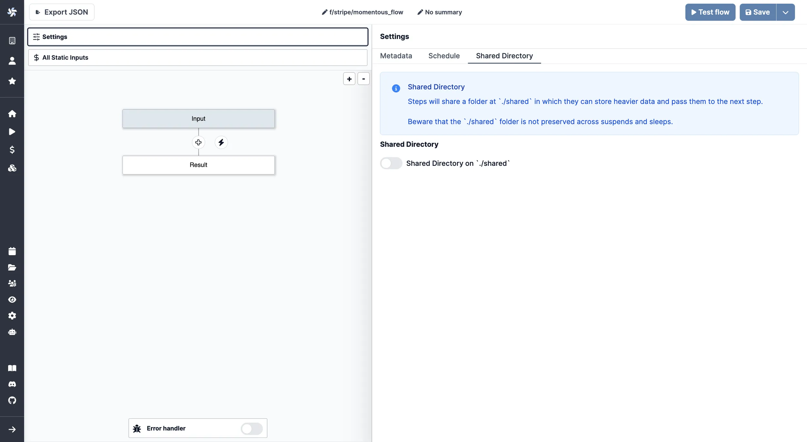

import DocCard from '@site/src/components/DocCard';

# States, resources & shared directory

This page is part of our section on [Persistent storage & databases](./index.mdx) which covers where to effectively store and manage the data manipulated by Windmill. Check that page for more options on data storage.

States, resources and the shared directory are convenient for persisting small, transient JSON between job executions or for passing data between steps of a flow. They are not recommended as a general-purpose persistence layer: they are meant for small payloads, and the shared directory is ephemeral to a single flow execution. For larger or long-lived data, prefer an external database or [object storage (S3, R2, MinIO, Azure Blob, GCS)](./large_data_files.mdx).

## States and resources

Within Windmill, you can use [states](../3_resources_and_types/index.mdx#states) and [resources](../3_resources_and_types/index.mdx) as a way to store a transient state - that can be represented as small JSON.

- A [state](../3_resources_and_types/index.mdx#states) is an object stored as a resource of the resource type `state` which is meant to persist across distinct executions of the same script (by the same trigger). States are what enable flows to watch for changes in most event watching scenarios ([trigger scripts](../../flows/10_flow_trigger.mdx)). Use `getState`/`setState` (TypeScript) or `get_state`/`set_state` (Python) from the wmill client.
- [Custom flow states](../3_resources_and_types/index.mdx#custom-flow-states) store data across steps in a [flow](../../flows/1_flow_editor.mdx): set and retrieve a value given a key from any step, with the same lifetime as the flow [job](../20_jobs/index.mdx) itself.
- For an arbitrary path or a type other than `state`, use `setResource`/`getResource` to persist any JSON as a [resource](../3_resources_and_types/index.mdx) that can be shared across scripts and flows. [Variables](../2_variables_and_secrets/index.mdx) are similar but untyped, string-only, and can be tagged as `secret`.

	<DocCard
		title="States"
		description="A state is an object stored as a resource of the resource type `state` which is meant to persist across distinct executions of the same script."
		href="/docs/core_concepts/resources_and_types#states"
	/>
	<DocCard
		title="Custom flow states"
		description="You can set and retrieve a value given a key from any step of flow and it will be available from within the flow globally."
		href="/docs/core_concepts/resources_and_types#custom-flow-states"
	/>
	<DocCard
		title="Resources and resource types"
		description="Resources are structured configurations and connections to third-party systems, with Resource types defining the schema for each Resource."
		href="/docs/core_concepts/resources_and_types"
	/>

## Shared directory

For heavier ETL processes or sharing data between steps in a flow, Windmill provides a Shared Directory feature. This allows steps within a flow to share data by storing it in a designated folder at `./shared`.

:::caution
Although Shared Directories are recommended for persisting states within a flow, it's important to note that:

- All steps are executed on the same worker
- The data stored in the Shared Directory is strictly ephemeral to the flow execution
- The contents are not preserved across [suspends](../../flows/11_flow_approval.mdx) and [sleeps](../../flows/15_sleep.md)
  :::

To enable the Shared Directory:

1. Open the `Settings` menu in the Windmill interface
2. Go to the `Shared Directory` section
3. Toggle on the option for `Shared Directory on './shared'`

Once enabled, steps can read and write files to the `./shared` folder to pass data between them. This is particularly useful for:

- Handling larger datasets that would be impractical to pass as step inputs/outputs
- Temporary storage of intermediate processing results
- Sharing files between steps in an ETL pipeline
