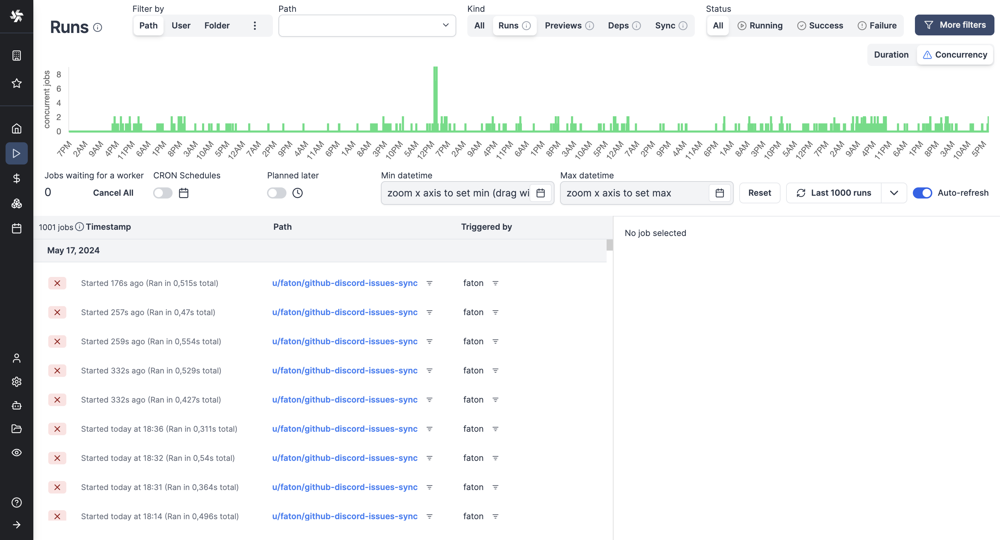
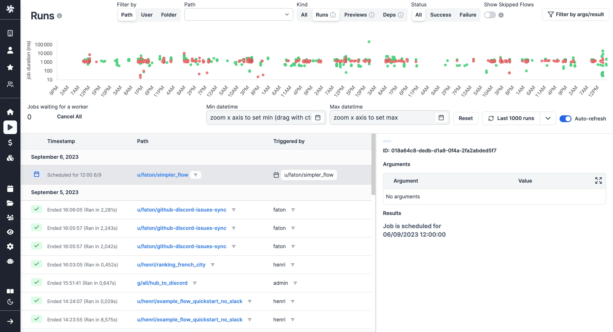

import DocCard from '@site/src/components/DocCard';

# Jobs runs

Each workspace has a dedicated Runs menu that allows you to visualise all past and future runs. In Windmill, each run is associated with a [job](../20_jobs/index.mdx).

<video
	className="border-2 rounded-lg object-cover w-full h-full dark:border-gray-800"
	autoPlay
	loop
	controls
	id="main-video"
	src="/videos/runs-menu.mp4"
/>

<br />

You might also be interested in Audit logs:

<div className="grid grid-cols-2 gap-6 mb-4">
	<DocCard
		title="Audit logs"
		description="Audit logs are another feature, available in the Cloud & Enterprise Self-Hosted only. They capture and record every operation and action with side-effects."
		href="/docs/core_concepts/audit_logs"
	/>
</div>

## Aggregated view

The Runs menu in each workspace provides a time series view where you can monitor different time slots.
The green (respectively, red) dots being the tasks that succeeded (respectively, failed).

You can filter the view per datetime, toggle "CRON schedules" to disable the display of past [scheduled](../1_scheduling/index.mdx) jobs and "Planned later" to disable the display of [schedules](../1_scheduling/index.mdx) planned for later.


> All past and future runs of the workspace are visible from the menu.

<br/>

The graph can represent jobs on their Duration (default) or by Concurrency, meaning the number of concurrent jobs at a given time.



> Graphical view by concurrent jobs.

## Details per run

Clicking on each run in the menu opens a run page where you can view the run's state, inputs, and success/failure reasons.


> View of a past run.

<br />

You can also view [scheduled](../1_scheduling/index.mdx) runs from the run menu, which provides information on the arguments used and the next trigger.

View of a scheduled run:



> Although scheduled scripts and flows are visible on their [dedicated tab](../1_scheduling/index.mdx), the run menu helps you see the next scheduled one.

### Trigger

The run page shows a Trigger field with how the run was started: a [schedule](../1_scheduling/index.mdx), one of the [triggers](../../triggers/index.mdx) (HTTP route, Kafka, email, ...) or an [app](../../apps/0_app_editor/index.mdx).

Runs started through the API with a [token](../59_user_tokens/index.mdx) are all reported as `Webhook`, which covers [webhook](../4_webhooks/index.mdx) calls as well as the [CLI](../../advanced/3_cli/index.mdx) and the SDKs. Runs started from the Windmill interface have no trigger and the field is not displayed. The same goes for runs that predate the version which started recording it.

## Share a run

The Share button on a run page copies a read-only link to that run, with two options:

- Copy link for members: the usual run page, at `/run/<job id>?workspace=...&view_token=...`. The recipient must be logged in and be a member of the workspace, but does not need [permissions](../16_roles_and_permissions/index.mdx) on the script or flow that ran.
- Copy public link: a minimal public run page, at `/public_run/<workspace>/<job id>?view_token=...`. Anyone holding the link can open it, logged in or not.

The public run page shows the run status and its inputs, plus the result and logs for a script run. For a [flow](../../flows/1_flow_editor.mdx) run, it shows the flow graph with each step's inputs, result and logs, updating live while the flow is still running. It cannot expand a subflow: the definition of the subflow is not part of the run, so opening it requires being logged in with access to that flow.

{/* TODO: screenshot of the Share dropdown on a run page, showing the two entries "Copy link for members" and "Copy public link" with their tooltips. A second one could show the public run page of a completed flow as an anonymous visitor: Windmill header with the blue "Public read-only view" badge, status, inputs and the flow graph. */}

Both links grant read access only, to that run and to the steps of its flow. Cancelling, force cancelling, resuming a [suspended step](../../flows/11_flow_approval.mdx) and minting further share links are never granted, whatever the link and whoever opens it. Since the link itself is the credential, the public run page asks search engines not to index it and sends no referrer.

Share links are signatures rather than stored grants, so they have no expiry and cannot be revoked one by one. Updating the [workspace encryption key](../30_workspace_secret_encryption/index.mdx) invalidates all of the workspace's outstanding share links at once.

Minting a public link is always recorded in the [audit logs](../14_audit_logs/index.mdx), as the `jobs.share_publicly` operation. On [Enterprise Edition](/pricing), workspace admins can control who is allowed to mint one with the [Restrict public run sharing](../56_protection_rulesets/index.mdx#restrict-public-run-sharing) protection rule. A [token](../59_user_tokens/index.mdx) restricted to specific tags cannot mint a public link at all, since an anonymous viewer carries no scope and the link could not keep that restriction on the run's steps.

## Filters

You can adjust the level of details by picking playing with filters on:

- **Datetime**
- **Metadata**: [Path](../16_roles_and_permissions/index.mdx#path) / [User](../16_roles_and_permissions/index.mdx#users) / [Folder](../8_groups_and_folders/index.mdx) / [Worker](../9_worker_groups/index.mdx) / [Concurrency key](../21_concurrency_limits/index.md#custom-concurrency-key) / [Labels](#jobs-labels)
- **Kind**: All / Runs / Previews / Dependencies
- **[Trigger kind](#trigger)**: Webhook / Schedule / HTTP route / Kafka / ... - can be negated to exclude a kind, for instance to hide all scheduled runs
- **Status**: All / Success / Failure
- **Skipped flows**
- **Arguments**
- **Results**

Example of filters in use:


> Here were filtered successful runs from August 2023 which returned `{"baseNumber": 11}`.

<br/>

Filter by worker, labels or tags support wildcards (*) by enabling `allow wildcards (*)` in the filter.


> Enable wildcards to filter a [label](#jobs-labels)

You can also filter by argument directly from a script / flow [deployed](../0_draft_and_deploy/index.mdx) page.


## Jobs labels

Labels allow to add static or dynamic tags to [jobs](../20_jobs/index.mdx) with property "wm_labels" followed by an array of strings.

```js
export async function main() {
  return {
    "wm_labels": ["showcase_labels", "another_label"]
  }
}
```

Jobs can be filtered by labels in the Runs menu to monitor specific groups of jobs.


## Invisible runs

When this option is enabled, manual executions of this script or flow are invisible to users other than the user running it, including the owner(s). This setting can be overridden when this script is run manually from the advanced menu.

## Batch actions

You can cancel or re-run multiple job runs at once. You can manually select them, or you can cancel or re-run all jobs matching current filters if you are admin.

When re-running jobs, you can set their inputs statically or with a JavaScript expression. By default, jobs re-run with the same arguments.
You may choose to re-run the job on their original script version or the latest one. Flows can only run on their latest version.

In the example below, we choose to re-run the job on the latest version of the script. We use the original bannedAt value when available, but bannedAt was not defined in older versions, so we fallback to the job original scheduled date. We also transform the username by adding a `@` prefix.


Multiple jobs may have run different versions of a script, which may have different schemas. Checking for the script hash narrows the type of the input, which allows the linter to show you the correct input type depending on the script version. Windmill will automatically generate code like this by default:

```js
// 'a' has different types depending on the script version
if (job.script_hash === 'edaf364678e4672a') {
	job.input.a // 'a' is a boolean
} else if (job.script_hash === '1df16d1abdd02f6b') {
	job.input.a // 'a' is a number
}
```