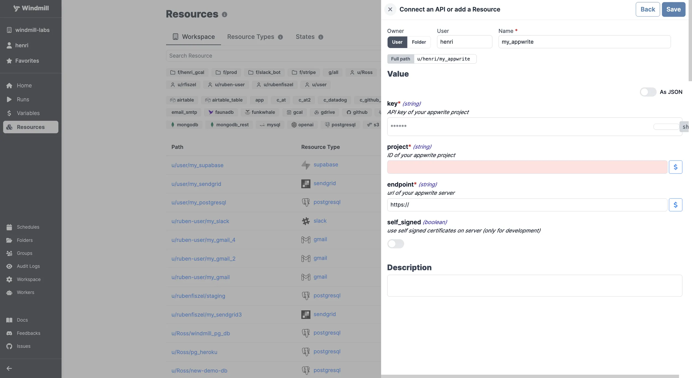

import ResourceUsage from './_resource_usage.mdx';

# Appwrite integration

[Appwrite](https://appwrite.io/) is an end-to-end backend server for web and mobile apps.

To integrate Appwrite to Windmill, you need to save the following elements as a [resource](../core_concepts/3_resources_and_types/index.mdx).

| Property    | Type    | Description                                                   | Default  | Required | Where to find                                           |
| ----------- | ------- | ------------------------------------------------------------- | -------- | -------- | ------------------------------------------------------- |
| endpoint    | string  | url of your appwrite server                                   | https:// | true     | Your Appwrite server's URL                              |
| project     | string  | ID of your appwrite project                                   |          | true     | Appwrite Dashboard > Your Project > Settings > ID       |
| key         | string  | API key of your appwrite project                              |          | true     | Appwrite Dashboard > Your Project > API Keys            |
| self_signed | boolean | use self signed certificates on server (only for development) |          | false    | (This is a configuration option, not found on Appwrite) |

<ResourceUsage name="Appwrite" />

