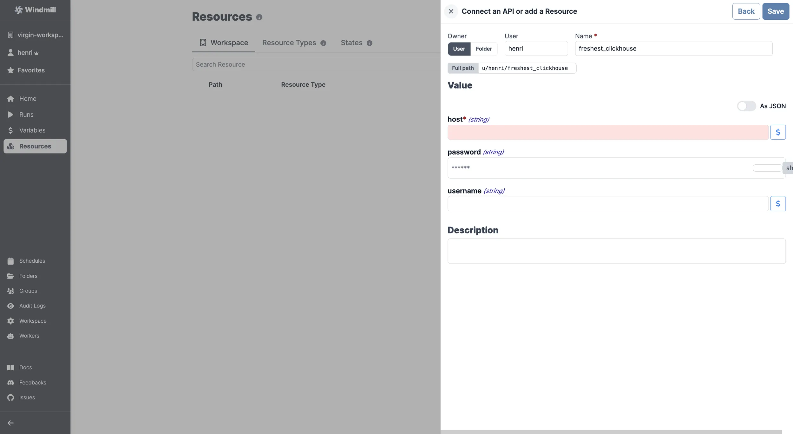

import ResourceUsage from './_resource_usage.mdx';

# ClickHouse integration

[ClickHouse](https://clickhouse.com/) is an open-source column-oriented database management system.

To integrate ClickHouse to Windmill, you need to save the following elements as a [resource](../core_concepts/3_resources_and_types/index.mdx).

| Property | Type   | Description                         | Default | Required | Where to Find                                                                                |
| -------- | ------ | ----------------------------------- | ------- | -------- | -------------------------------------------------------------------------------------------- |
| host     | string | Hostname or IP of ClickHouse server |         | true     | Provided by your hosting provider or found in the ClickHouse config file (`config.xml`)      |
| username | string | Username for ClickHouse connection  |         | false    | Found in the ClickHouse users config file (`users.xml`) or provided by your hosting provider |
| password | string | Password for ClickHouse connection  |         | false    | Found in the ClickHouse users config file (`users.xml`) or provided by your hosting provider |

<ResourceUsage name="ClickHouse" hub="clickhouse" />

