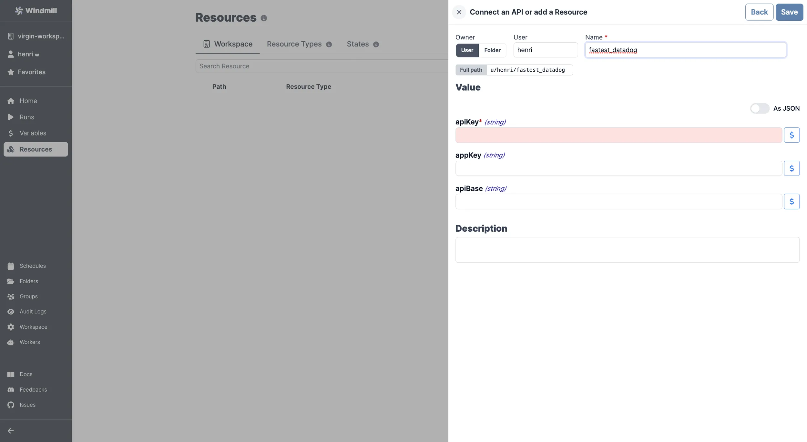

import ResourceUsage from './_resource_usage.mdx';

# Datadog integration

[Datadog](https://www.datadoghq.com/) is a monitoring and analytics platform for cloud-scale infrastructure and applications.

To integrate Datadog to Windmill, you need to save the following elements as a [resource](../core_concepts/3_resources_and_types/index.mdx).

| Property | Type   | Description                         | Default | Required | Where to Find                                                                                    |
| -------- | ------ | ----------------------------------- | ------- | -------- | ------------------------------------------------------------------------------------------------ |
| apiKey   | string | Datadog API key for authentication  |         | true     | Datadog Dashboard > Integrations > APIs > API Keys                                               |
| appKey   | string | Datadog APP key for specific access |         | false    | Datadog Dashboard > Integrations > APIs > Application Keys                                       |
| apiBase  | string | Base URL for the Datadog API        |         | false    | Datadog API documentation (default: `https://api.datadoghq.com` or region-specific API base URL) |

<ResourceUsage name="Datadog" hub="datadog" />

