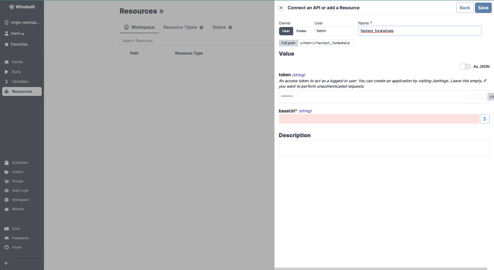

import ResourceUsage from './_resource_usage.mdx';

# Funkwhale integration

[Funkwhale](https://funkwhale.audio/) is an open-source music streaming and sharing platform.

To integrate Funkwhale to Windmill, you need to save the following elements as a [resource](../core_concepts/3_resources_and_types/index.mdx).

| Property | Type   | Description                                                                     | Default | Required | Where to Find                                         |
| -------- | ------ | ------------------------------------------------------------------------------- | ------- | -------- | ----------------------------------------------------- |
| baseUrl  | string | Base URL of your Funkwhale instance                                             |         | true     | Authorize URL is at /authorize                        |
| token    | string | Access token to act as a logged-in user (optional for unauthenticated requests) |         | false    | Funkwhale > Settings > Applications > New Application |

<ResourceUsage name="Funkwhale" hub="funkwhale" />

