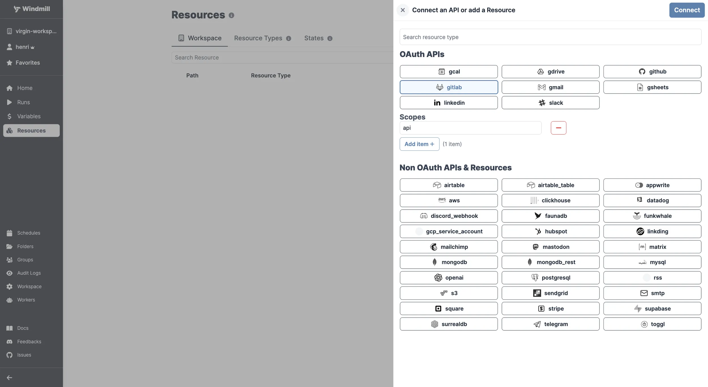

import DocCard from '@site/src/components/DocCard';

import ResourceUsage from './_resource_usage.mdx';

# GitLab integration

[GitLab](https://about.gitlab.com/) is a web-based Git-repository manager with CI/CD capabilities.

The GitLab integration is done through OAuth. You just need to sign in from your GitLab account on your browser. The access will be automatically saved to the workspace as a [resource](../core_concepts/3_resources_and_types/index.mdx).

On [self-hosted instances](../advanced/1_self_host/index.mdx), integrating an OAuth API will require [Setup OAuth and SSO](../advanced/27_setup_oauth/index.mdx).

	<DocCard
		title="Deploy to prod using a git workflow"
		description="Windmill integration with Git repositories makes it possible to adopt a robust development process for your Windmill scripts, flows and apps."
		href="/docs/advanced/deploy_gh_gl"
	/>

<ResourceUsage name="GitLab" hub="gitlab" />

