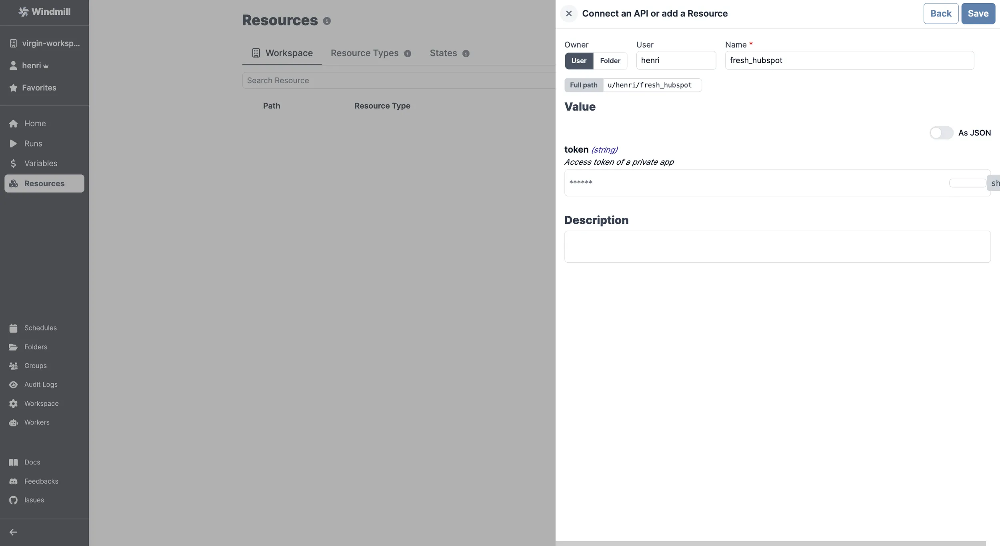

import ResourceUsage from './_resource_usage.mdx';

# HubSpot integration

[HubSpot](https://www.hubspot.com/) is an inbound marketing, sales, and customer service platform.

To integrate HubSpot to Windmill, you need to save the following elements as a [resource](../core_concepts/3_resources_and_types/index.mdx).

| Property | Type   | Description                   | Default | Required | Where to Find                                                          |
| -------- | ------ | ----------------------------- | ------- | -------- | ---------------------------------------------------------------------- |
| token    | string | Access token of a private app |         | false    | HubSpot > Settings > Integrations > API key > Create private app token |

<ResourceUsage name="HubSpot" hub="hubspot" />

