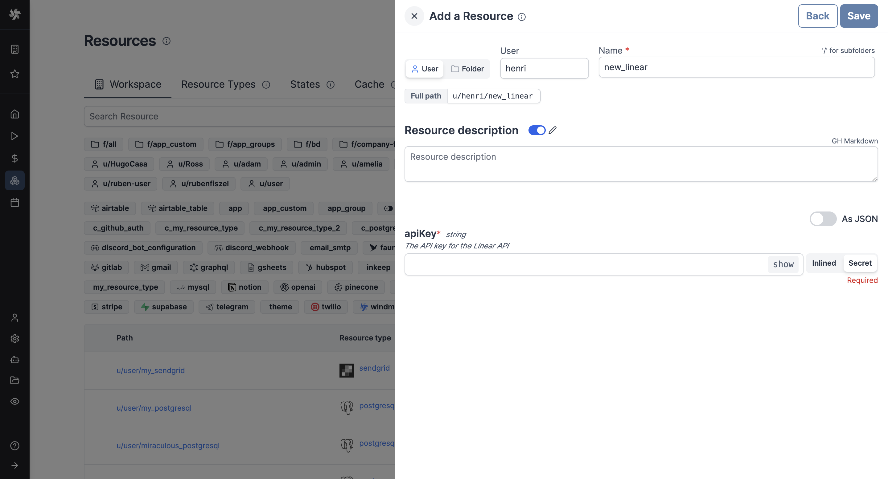

import ResourceUsage from './_resource_usage.mdx';

# Linear integration

[Linear](https://linear.app/) is a project management tool for software development teams.

To integrate Linear to Windmill, you need to save the following elements as a [resource](../core_concepts/3_resources_and_types/index.mdx).

| Property | Type   | Description                                                             | Default | Required | Where to Find                                                                                      |
| -------- | ------ | ----------------------------------------------------------------------- | ------- | -------- | -------------------------------------------------------------------------------------------------- |
| apiKey    | string | The API key for the Linear API.                              |   https://linear.app/settings/api      | false    |  |

<ResourceUsage name="Linear" hub="linear" />

