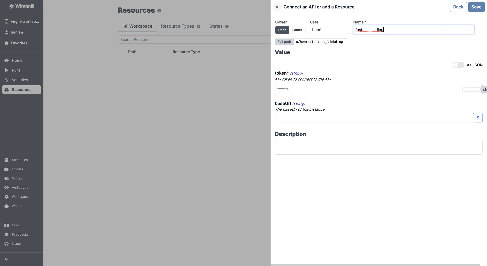

import ResourceUsage from './_resource_usage.mdx';

# Linkding integration

[Linkding](https://github.com/sissbruecker/linkding) is a self-hosted bookmark manager.

To integrate Linkding to Windmill, you need to save the following elements as a [resource](../core_concepts/3_resources_and_types/index.mdx).

| Property | Type   | Description                     | Default | Required | Where to Find                                 |
| -------- | ------ | ------------------------------- | ------- | -------- | --------------------------------------------- |
| token    | string | API token to connect to the API |         | true     | Linkding > User Settings > Generate API token |
| baseUrl  | string | The base URL of the instance    |         | false    | Provided by your Linkding hosting provider    |

<ResourceUsage name="Linkding" />

