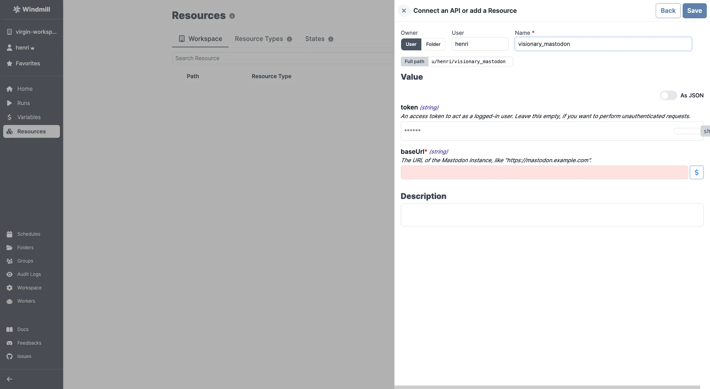

import ResourceUsage from './_resource_usage.mdx';

# Mastodon integration

[Mastodon](https://mastodon.social/) is an open-source, decentralized social network.

To integrate Mastodon to Windmill, you need to save the following elements as a [resource](../core_concepts/3_resources_and_types/index.mdx).

| Property | Type   | Description                                                             | Default | Required | Where to Find                                                                                      |
| -------- | ------ | ----------------------------------------------------------------------- | ------- | -------- | -------------------------------------------------------------------------------------------------- |
| baseUrl  | string | The URL of the Mastodon instance (e.g., "https://mastodon.example.com") |         | true     | Provided by your Mastodon hosting provider or Mastodon instance URL for self-hosted instances      |
| token    | string | An access token to act as a logged-in user                              |         | false    | Mastodon > Preferences > Development > Your Applications > New Application > Generate access token |

<ResourceUsage name="Mastodon" hub="mastodon" />

