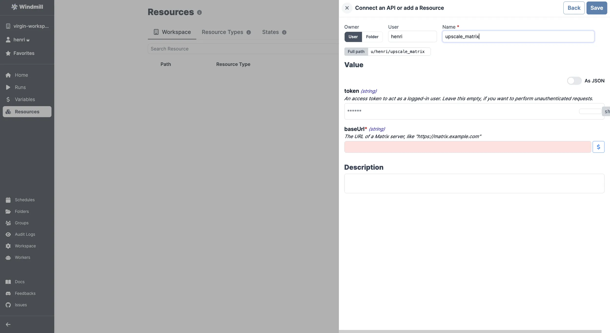

import ResourceUsage from './_resource_usage.mdx';

# Matrix integration

[Matrix](https://matrix.org/) is an open standard for decentralized, real-time communication.

To integrate Matrix to Windmill, you need to save the following elements as a [resource](../core_concepts/3_resources_and_types/index.mdx).

| Property | Type   | Description                                                     | Default | Required | Where to Find                                                                             |
| -------- | ------ | --------------------------------------------------------------- | ------- | -------- | ----------------------------------------------------------------------------------------- |
| baseUrl  | string | The URL of a Matrix server (e.g., "https://matrix.example.com") |         | true     | Provided by your Matrix hosting provider or Matrix instance URL for self-hosted instances |
| token    | string | An access token to act as a logged-in user                      |         | false    | Matrix > Settings > Security & Privacy > Access Token > Reveal Access Token               |

<ResourceUsage name="Matrix" hub="matrix" />

