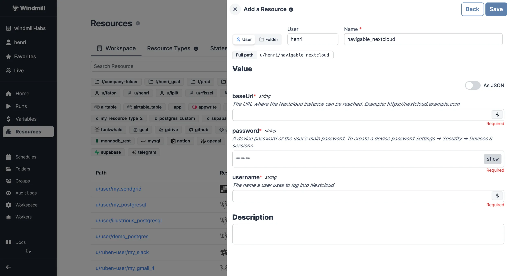

import ResourceUsage from './_resource_usage.mdx';

# Nextcloud integration

[Nextcloud](https://nextcloud.com/) is a suite of client-server software for creating and using file hosting services.

To integrate Nextcloud to Windmill, you need to save the following elements as a [resource](../core_concepts/3_resources_and_types/index.mdx).

| Property | Type   | Description                                                 | Default | Required | Where to Find                                           |
| -------- | ------ | ----------------------------------------------------------- | ------- | -------- | ------------------------------------------------------- |
| username | string | The username for accessing the Nextcloud instance           |         | true     | Your Nextcloud account credentials                     |
| password | string | The password associated with the provided username          |         | true     | Your Nextcloud account credentials                     |
| baseUrl  | string | The base URL of the Nextcloud instance (e.g., "https://nextcloud.example.com") |         | true     | Found in the address bar of your Nextcloud instance    |
  

<ResourceUsage name="Nextcloud" hub="nextcloud" />

## Native triggers

You can use [native triggers](../core_concepts/52_native_triggers/index.mdx) to automatically run scripts or flows when files or folders change on your Nextcloud instance. Native triggers receive real-time push notifications so your runnables execute as soon as events occur.

