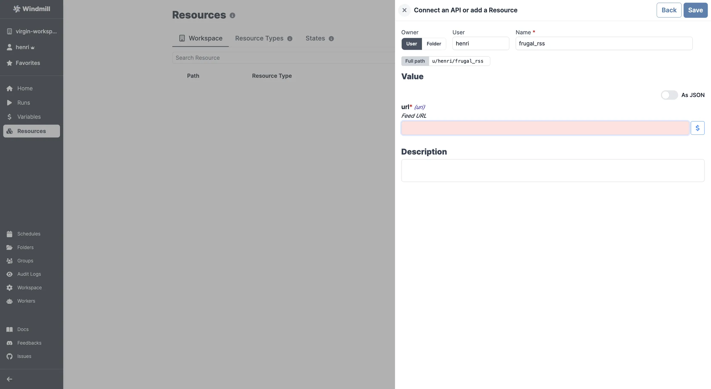

import ResourceUsage from './_resource_usage.mdx';

# RSS integration

[RSS](https://rss.com/) is a web feed that allows users and applications to access updates to websites.

To integrate RSS to Windmill, you need to save the following elements as a [resource](../core_concepts/3_resources_and_types/index.mdx).

| Property | Type   | Description | Default | Required | Where to Find                           |
| -------- | ------ | ----------- | ------- | -------- | --------------------------------------- |
| url      | string | Feed URL    |         | true     | Provided by the RSS feed source website |

<ResourceUsage name="RSS" hub="RSS" />

