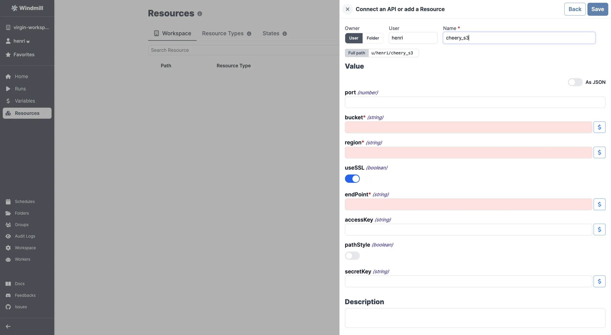
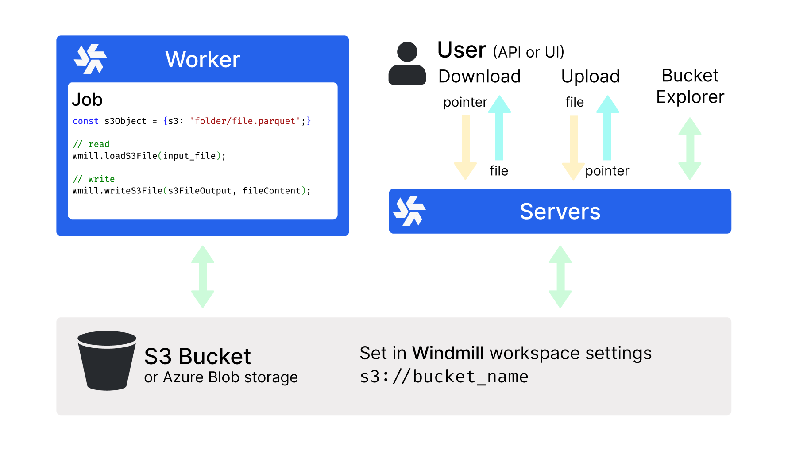
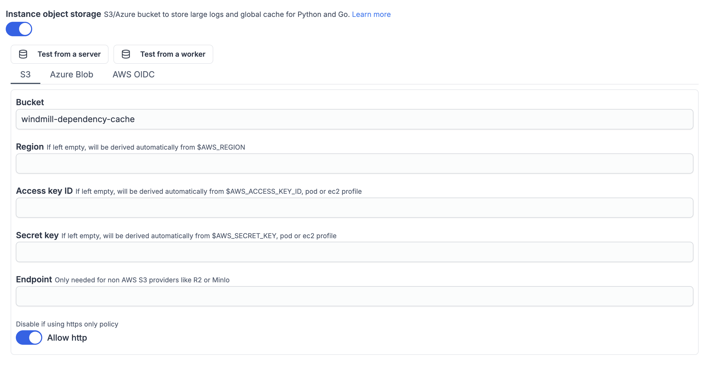

import DocCard from '@site/src/components/DocCard';

import ResourceUsage from './_resource_usage.mdx';

# S3 APIs integrations

S3 is a cloud-based object storage service designed to store and retrieve any amount of data.

Instance and workspace object storage are different from using S3 resources within scripts, flows, and apps, which is free and unlimited. This is what is [described in this page](#add-a-s3-resource).

At the [workspace level](../core_concepts/38_object_storage_in_windmill/index.mdx#workspace-object-storage), what is exclusive to the [Enterprise](/pricing) version is using the integration of Windmill with S3 that is a major convenience layer to enable users to read and write from S3 without having to have access to the credentials.

Additionally, for [instance integration](../core_concepts/38_object_storage_in_windmill/index.mdx#instance-object-storage), the Enterprise version offers advanced features such as large-scale log management and distributed dependency caching.

Windmill provides a unique [resource type](https://hub.windmill.dev/resource_types/42/) for any API following the typical S3 schema.

## Add a S3 resource

Here are the required details:

| Property  | Type    | Description                                     | Default | Required |
| --------- | ------- | ----------------------------------------------- | ------- | -------- |
| bucket    | string  | S3 bucket name                                  |         | true     |
| region    | string  | S3 region for the bucket (e.g. `eu-west-3`)     |         | true     |
| endPoint  | string  | S3 endpoint (e.g. `s3.eu-west-3.amazonaws.com`) |         | true     |
| useSSL    | boolean | Use SSL for connections                         | true    | false    |
| pathStyle | boolean | Use path-style addressing                       | false   | false    |
| accessKey | string  | Access key ID                                   |         | false    |
| secretKey | string  | Secret access key                               |         | false    |

`accessKey` and `secretKey` are optional in the resource type but required by most providers (Amazon S3, Cloudflare R2, Tigris); leave them empty only for setups relying on public buckets or ambient credentials.

For guidelines on where to find these details on a given platform, see the provider pages:

	<DocCard
		title="Amazon S3"
		description="Where to find the S3 resource details for Amazon S3."
		href="/docs/integrations/aws-s3"
	/>
	<DocCard
		title="Cloudflare R2"
		description="Where to find the S3 resource details for Cloudflare R2."
		href="/docs/integrations/cloudflare-r2"
	/>
	<DocCard
		title="Tigris"
		description="Where to find the S3 resource details for Tigris."
		href="/docs/integrations/tigris"
	/>
	<DocCard
		title="Google Cloud Storage"
		description="GCS uses its own resource type based on a service account key."
		href="/docs/integrations/google-cloud-storage"
	/>
	<DocCard
		title="Microsoft Azure Blob"
		description="Azure Blob uses its own resource type based on an account name and access key."
		href="/docs/integrations/microsoft-azure-blob"
	/>

<ResourceUsage name="S3" hub="s3" />

## Workspace object storage

Once you've created an S3, Azure Blob, or Google Cloud Storage resource in Windmill, you can use Windmill's native integration with S3, Azure Blob, or GCS, making it the recommended storage for large objects like files and binary data.

The workspace object storage is exclusive to the [Enterprise](/pricing) edition. It is meant to be a major convenience layer to enable users to read and write from S3 without having to have access to the credentials.

	<DocCard
		title="Workspace object storage"
		description="Connect your Windmill workspace to your S3 bucket, your Azure Blob storage, or your GCS bucket to enable users to read and write from S3 without having to have access to the credentials."
		href="/docs/core_concepts/object_storage_in_windmill#workspace-object-storage"
	/>

## Instance object storage

Under [Enterprise Edition](/pricing), instance object storage offers advanced features to enhance performance and scalability at the [instance](../advanced/18_instance_settings/index.mdx) level. This integration is separate from the [Workspace object storage](#workspace-object-storage) and provides solutions for large-scale log management and distributed dependency caching.

	<DocCard
		title="Instance object storage"
		description="Connect your Windmill instance to your S3 bucket, your Azure Blob storage, or your GCS bucket to enable users to read and write from S3 without having to have access to the credentials."
		href="/docs/core_concepts/object_storage_in_windmill#instance-object-storage"
	/>

