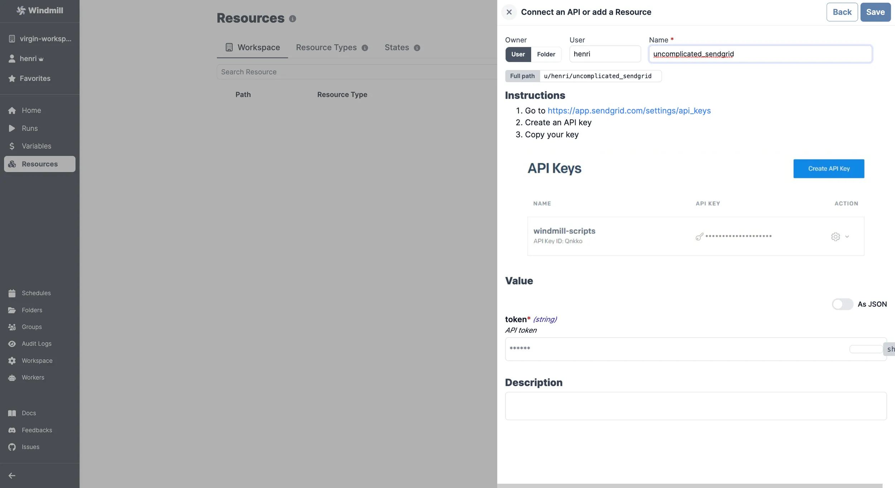

import ResourceUsage from './_resource_usage.mdx';

# SendGrid integration

[SendGrid](https://sendgrid.com/) is an email API and delivery service.

To integrate SendGrid to Windmill, you need to save the following elements as a [resource](../core_concepts/3_resources_and_types/index.mdx).

| Property | Type   | Description | Required | Where to find                                                                      |
| -------- | ------ | ----------- | -------- | ---------------------------------------------------------------------------------- |
| token    | string | API token   | true     | 1. https://app.sendgrid.com/settings/api_keys 2.Create an API key 3. Copy your key |

<ResourceUsage name="SendGrid" hub="sendgrid" />

