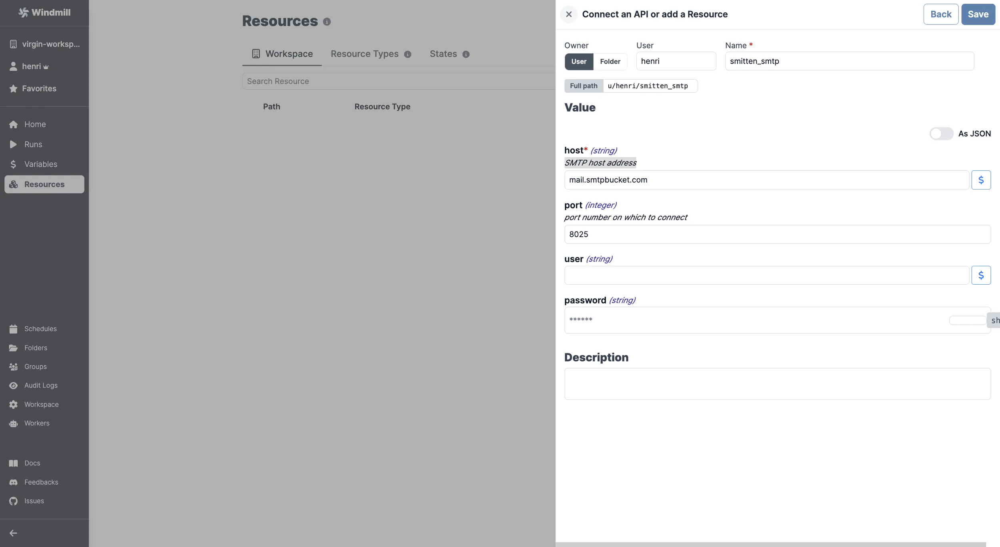

import ResourceUsage from './_resource_usage.mdx';

# SMTP integration

[SMTP](https://en.wikipedia.org/wiki/Simple_Mail_Transfer_Protocol) (Simple Mail Transfer Protocol) is an internet standard for electronic mail transmission.

Note that SMTP can be configured at the instance level to auto-invite users or send [critical alerts](../core_concepts/37_critical_alerts/index.mdx). See [Set up SMTP](../advanced/18_instance_settings/index.mdx#smtp).

To add a SMTP [resource](../core_concepts/3_resources_and_types/index.mdx) to Windmill, you need to save the following elements:

| Property | Type   | Description            | Required | Where to find                                           |
| -------- | ------ | ---------------------- | -------- | ------------------------------------------------------- |
| host     | string | SMTP host address      | true     | Provided by your SMTP service or email hosting provider |
| port     | number | Port number to connect | false    | Provided by your SMTP service or email hosting provider |
| user     | string | SMTP username          | false    | Provided by your SMTP service or email hosting provider |
| password | string | SMTP password          | false    | Provided by your SMTP service or email hosting provider |

<ResourceUsage name="SMTP" hub="smtp" />

