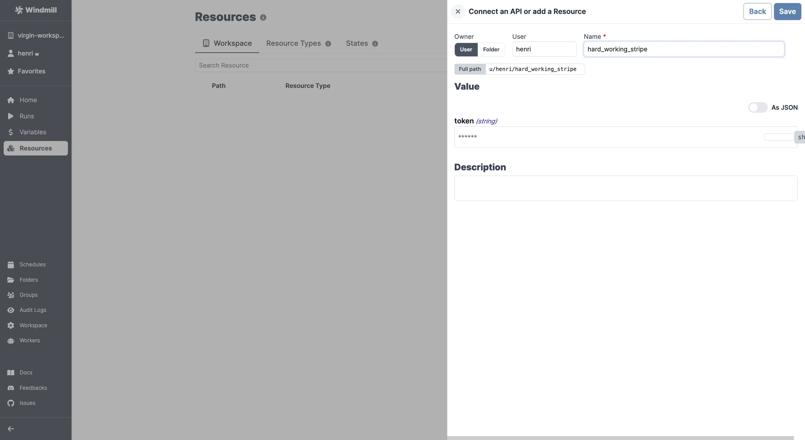

import ResourceUsage from './_resource_usage.mdx';

# Stripe integration

[Stripe](https://stripe.com/) is a payment processing platform.

To integrate Stripe to Windmill, you need to save the following elements as a [resource](../core_concepts/3_resources_and_types/index.mdx).

| Property | Type   | Description | Required | Where to find                                            |
| -------- | ------ | ----------- | -------- | -------------------------------------------------------- |
| token    | string | API token   | true     | Stripe Dashboard -> Developers -> API keys -> Secret key |

<ResourceUsage name="Stripe" hub="stripe" />

