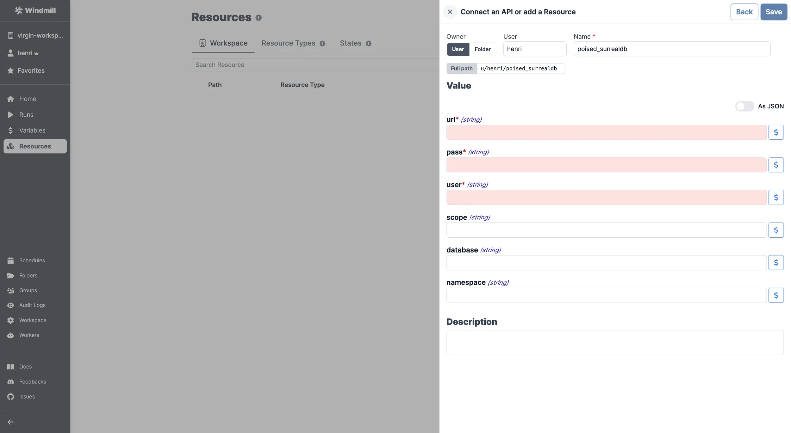

import ResourceUsage from './_resource_usage.mdx';

# SurrealDB integration

[SurrealDB](https://surrealdb.com/) is a cloud-hosted NoSQL database.

To integrate SurrealDB to Windmill, you need to save the following elements as a [resource](../core_concepts/3_resources_and_types/index.mdx).

| Property  | Type   | Description                              | Required | Where to find                                      |
| --------- | ------ | ---------------------------------------- | -------- | -------------------------------------------------- |
| namespace | string | Namespace for the SurrealDB instance     | true     | SurrealDB Dashboard -> Namespaces                  |
| database  | string | Database name for the SurrealDB instance | true     | SurrealDB Dashboard -> Databases                   |
| scope     | string | Scope of the SurrealDB instance          | true     | SurrealDB Dashboard -> Scopes                      |
| user      | string | Username for the SurrealDB instance      | false    | SurrealDB Dashboard -> Users                       |
| pass      | string | Password for the SurrealDB instance      | false    | SurrealDB Dashboard -> Users                       |
| url       | string | URL of the SurrealDB instance            | false    | Provided by SurrealDB when you create the instance |

<ResourceUsage name="SurrealDB" />

