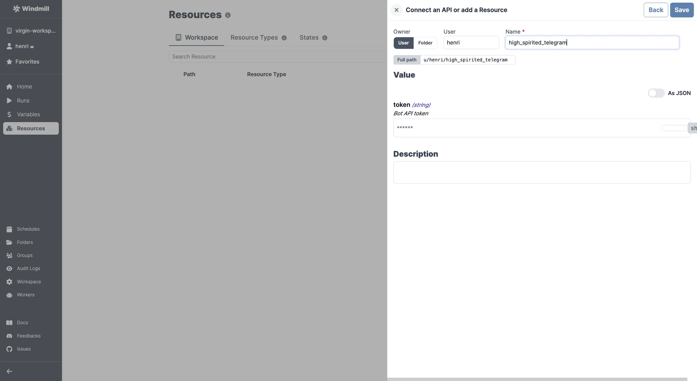

import ResourceUsage from './_resource_usage.mdx';

# Telegram integration

[Telegram](https://telegram.org/) is a cloud-based instant messaging and voice over IP service.

To integrate Telegram to Windmill, you need to save the following elements as a [resource](../core_concepts/3_resources_and_types/index.mdx).

| Property | Type   | Description   | Required | Where to find                                                                                                                                                                                                                                                                                                                                                                                                              |
| -------- | ------ | ------------- | -------- | -------------------------------------------------------------------------------------------------------------------------------------------------------------------------------------------------------------------------------------------------------------------------------------------------------------------------------------------------------------------------------------------------------------------------- |
| token    | string | Bot API token | true     | 1. Open the Telegram app on your device or use the web version (https://web.telegram.org/). 2. Search for the "BotFather" bot in the search bar. 3. Start a chat with the BotFather. 4. Send the command "/newbot" to create a new bot. 5. Follow the BotFather's instructions to give your bot a name and username. 6. Once you have successfully created the bot, the BotFather will provide you with the Bot API token. |

<ResourceUsage name="Telegram" hub="telegram" />

