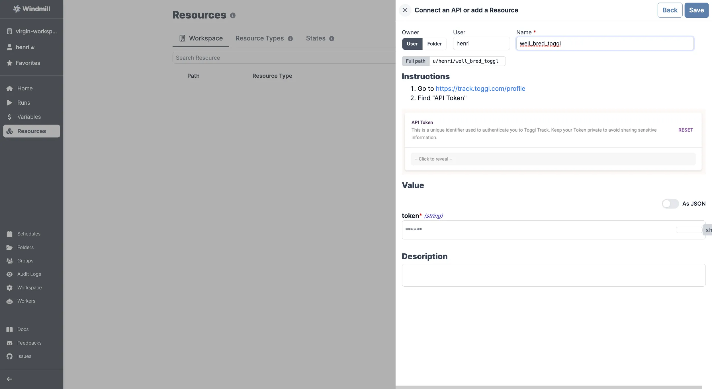

import ResourceUsage from './_resource_usage.mdx';

# Toggl integration

[Toggl](https://toggl.com/) is a time tracking software.

To integrate Toggl to Windmill, you need to save the following elements as a [resource](../core_concepts/3_resources_and_types/index.mdx).

| Property | Type   | Description | Required | Where to find                                                |
| -------- | ------ | ----------- | -------- | ------------------------------------------------------------ |
| token    | string | API token   | true     | 1. Go to https://track.toggl.com/profile 2. Find "API Token" |

<ResourceUsage name="Toggl" />

