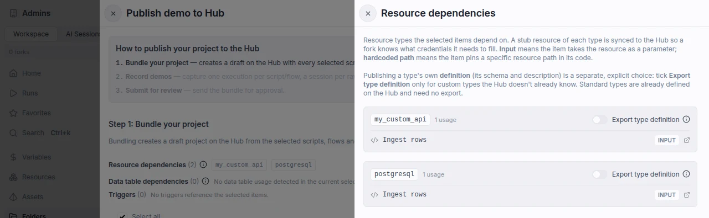
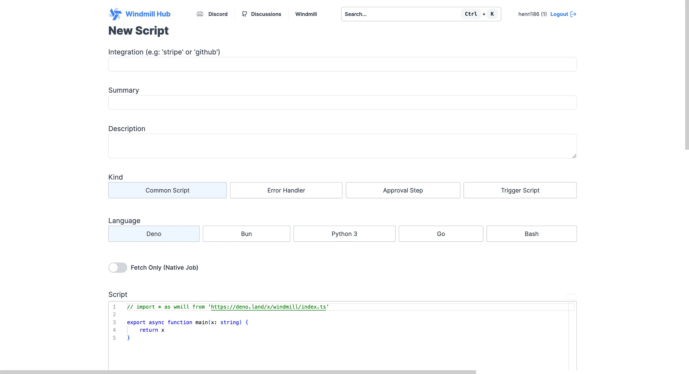
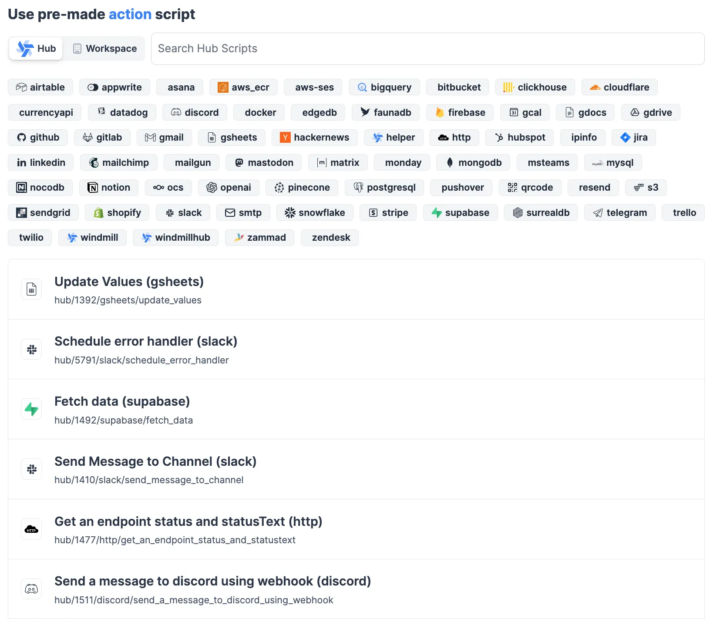
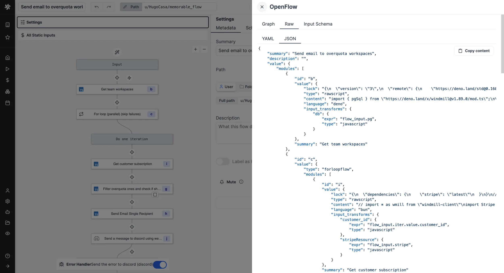
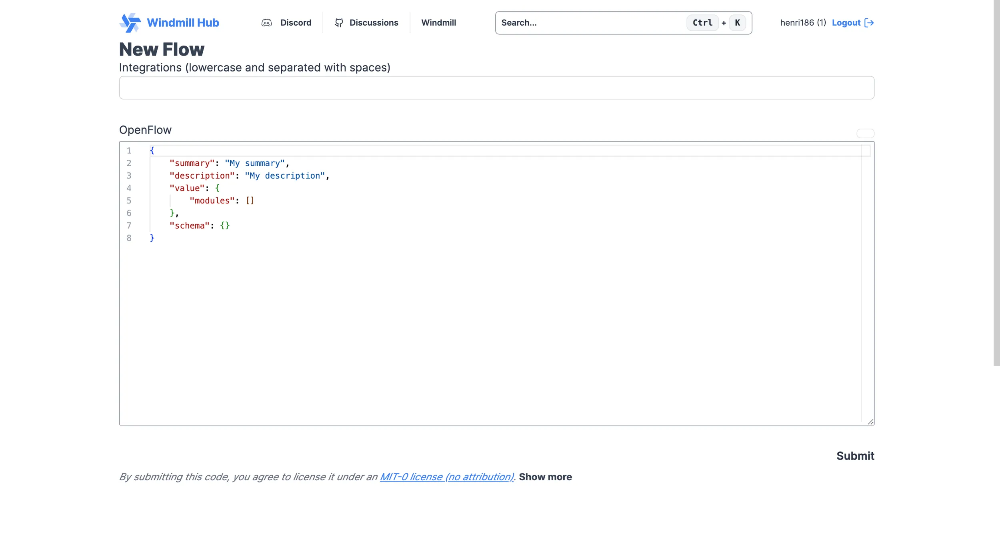
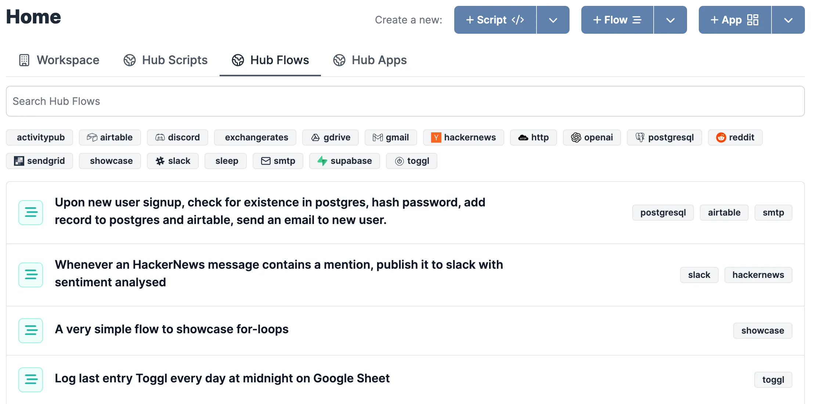
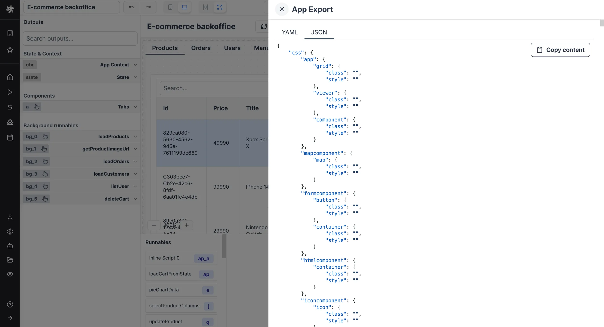
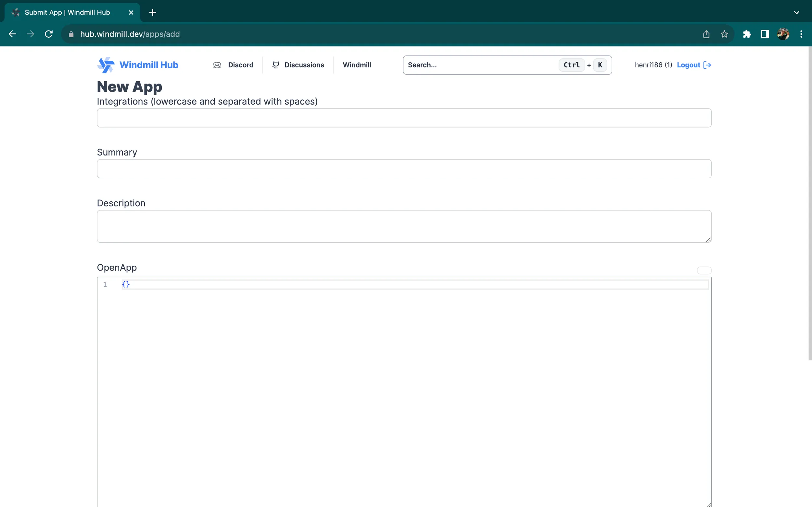
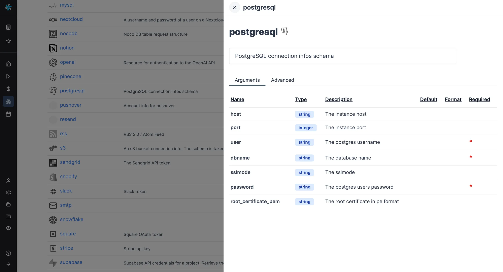

# Share on Windmill Hub

[Windmill Hub][wm-hub] is the community website of Windmill where you can find
and share your Scripts, Flows, Apps and Resource types with every Windmill user.
The best submissions get approved by the Windmill Team and get integrated
directly in the app for everyone to reuse easily.

Scripts can be written in TypeScript, Go, Python and Bash, however,
similarly to the Windmill app, TypeScript is the recommended language.

With the Hub, we aim to create a trusted support for users to save time and find inspirations to solve problems they didn't even know Windmill could crack! It is therefore also made for less technical users to get familiar with Windmill and find ways to improve their daily work.

The Hub is complementary to our [Discord][wm-discord] where community members give mutual support & kudos.

Below you will find guides on how to contribute to the Hub, thank you for being part of the community!

## Projects

A project bundles a whole [folder](../../core_concepts/8_groups_and_folders/index.mdx) - its scripts, flows, apps and the resources they depend on - into a single Hub page others can fork. Workspace admins publish one from the Folders page: open the `...` menu next to a folder and pick "Publish to Hub".

Publishing happens in three steps:

1. Bundle your project - pick the items of the folder to include and create a draft on the Hub.
2. Record demos - capture one execution per script or flow, one session per app, and the whole data pipeline as a single interactive replay, so visitors can see the project work before forking it. Optional but recommended.
3. Submit for review - the Windmill team approves the bundle before it goes live.

### Resource dependencies

The bundle step lists the [resource types](../../core_concepts/3_resources_and_types/index.mdx) the selected items depend on, either because an item takes a resource as an input, or because it pins a resource path in its code. Types derived from an input only count when the workspace actually declares them as a resource type, so a stale or misspelled `resource-<type>` argument format is ignored instead of being published as an empty type.

For every dependency, a stub resource is synced to the Hub, so a fork knows which credentials it needs to fill and a hardcoded `$res:` path in the published code still resolves. This is automatic and needs no action.

Publishing a type's own definition - its schema and description - is a separate, explicit choice. In the "Resource dependencies" drawer, turn on "Export type definition" for a type to include it in the project. It is off by default: only enable it for custom types the Hub does not already define. Standard types such as `postgresql` or `stripe` are already on the Hub and need no export. Exported types are marked with an `exported` badge in the bundle summary.

## Scripts

Currently [Windmill Hub][wm-hub] supports TypeScript (Deno and Bun), Python 3, Go or Bash scripts.
You can add Common, Error handler, Approval and Trigger scripts by
going to the <a rel="nofollow" href="https://hub.windmill.dev/scripts/add">New Script</a> page. The
Summary will be the title of the Script, Integration should have the name of
the app it integrates with (if there is one), and Description should be a
short description of the script - it supports Markdown.

Then you can do your magic and write your script for the community:

Once approved by the Windmill Team, the Script will be available for
everyone to use directly on Windmill cloud or [Self-Hosted](../../advanced/1_self_host/index.mdx) instances synced with Hub.

## Flows

Using the [OpenFlow](../../openflow/index.mdx) portable format, one can simply
copy the JSON from the Flow editor and paste it on the
[New Flow](https://hub.windmill.dev/flows/add) page to upload it to the Hub.

Then you can do your magic and share your flow for the community.

Once a Flow is approved by the Windmill Team, it will be directly integrated
into every workspace of every instance of Windmill.

## Apps

Using the [Hub Compatible JSON](../../apps/0_toolbar.mdx#hub-compatible-json) of an app, just paste the JSON of your app to [Windmill Hub](https://hub.windmill.dev/).

Once an App is approved by the Windmill Team, it will be directly integrated into every workspace of every instance of Windmill.

## Resource types

[Resource types](../../core_concepts/3_resources_and_types/index.mdx) are simply
[JSON Schemas](../../core_concepts/13_json_schema_and_parsing/index.mdx) which create a Type to
Resources by constraining the properties or fields that the Resource can have.
In addition, they serve two main purposes on Windmill:

- Filter Resources by Resource types for the generated UI.
- Allow to have a way to manually create Resources of the specified Resource
  Type using the autogenerated UI from their [JSON Schema](../../core_concepts/13_json_schema_and_parsing/index.mdx).

To add a Resource Type to the Windmill Hub, go to the
[New Resource Type](https://hub.windmill.dev/resource_types/add) page. You can
then add your arguments one by one or use the monaco editor to edit it as a JSON
directly.

Adding a Resource Type to the [Hub][wm-hub] will be available for every
Windmill user, once it is approved by the Windmill Team.

If it gets approved, the
windmill-gh-action-deploy will deploy it in the starter workspace of Windmill cloud. Being deployed on the
starter workspace means that it will be available to all workspaces.

---

Thank you for your interest in sharing your work on the Hub. Community is essential to our work to build a tool that is useful, powerful and fun to use.

<!-- Resources -->

[wm-hub]: https://hub.windmill.dev
[wm-discord]: https://discord.com/invite/V7PM2YHsPB
