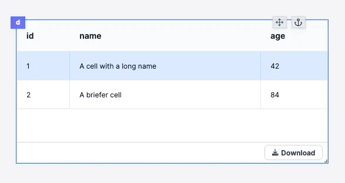

# Table

:::info Legacy

This guide uses the legacy low-code app editor. For new apps, we recommend [full-code apps](../../../full_code_apps/index.mdx) with React or Svelte.

:::

This is an introduction on how to use the Table component in Windmill.



## AgGrid vs Table component vs Database studio

In Windmill there are 3 table components: one simply called Table,
[AgGrid](../aggrid_table/index.md) and [Database studio](../../../apps/4_app_configuration_settings/database_studio.mdx).

The Table component covers most use cases. In its simplest form, it takes an
array of objects as input and uses the keys of the objects as the headers of the
table.

See the bottom of this document for the current limitations.
 
The [AgGrid](../aggrid_table/index.md) component provides many advanced features.

[Database studio](../../../apps/4_app_configuration_settings/database_studio.mdx) is a web-based database management tool. It allows you to display and edit the content of a database.

### Examples

:::info

[Table Showcase](https://hub.windmill.dev/apps/19/table-component-showcase) - See the Hub for an app that showcases all Table options as working code.
You can copy/paste from it directly, giving you both working code to look at and a fast starting point.
:::

## Table data (data source)

As with almost all fields in the app, the data can be `static`,
`connected` or `eval`.

**static** - a static JSON you define.

**connected** - connect to the result of another script or component, or to the
state of the app.

**eval** - run an inline eval that can refer to the state or to scripts, like connected.
Eval lets you type instead of clicking. You can also choose to refer to a
script from your workspace or create an inline script.

:::tip

You cannot edit the result of a script, so if you want to later change the data
based on another component, the recommendation is to store that data as a state.
:::

## Referring to data from the row to create a new row in the table

Sometimes you want to refer to the table data within the table itself, e.g. if you want to have a
select that is specific to each row using another field. This can be achieved
with the `row.value` and `row.index` properties.

You will find examples of using `row.value` and `row.index` in the showcase app above.

### Initial state

:::info

The initial state is from
https://tanstack.com/table/v8/docs/api/core/table#initialstate but not all
states work, currently `columnVisibility`, `columnOrder`, `columnPinning` and
`columnSizing` are implemented.

Pagination and search/filter are supported in the GUI, but not through this
config.

Grouping, row selection, sorting and expand are currently not supported.

:::

#### Hide columns

By default the Table component shows all columns. You can hide columns
with the following syntax.

In the `Initial State` field in the table config add:

```tsx
{
  "columnVisibility": {
    "id": false
  }
}
```

Here we hide the `id` column.

### Reorder columns

By default the Table component shows columns in the order they are added to
the array. You can rearrange the order of the columns with the following config.

In the `Initial State` field in the table config add:

```tsx
{
  "columnOrder": [
    "name",
    "age",
    "id"
  ]
}
```

Here we rearrange the order so we have the "name" column first and then "age",
"id".

### columnPinning

In the `Initial State` field in the table config add:

```tsx
{
  "columnPinning": {
    "left": [
      "name"
    ],
    "right": [
      "id"
    ]
  }
}


```

### columnSizing

In the `Initial State` field in the table config add:

```tsx
{
  "columnSizing": {
    "id": 10,
    "name": 750,
    "age": 150
  }
}
```

Leave out the fields you do not need: you only specify the desired behavior, and it is still TanStack logic that does the final calculations.

## Search

**by component** - a nice feature of the Table component is that it can do the
search for you based on the data in the component

**by runnable** - if you want programmatic control over the search. You
need to use a script as the data source and connect the table's
"search" key to an input of the script.

Please see the [Examples](#examples) for working code.

### Limits

- Button and Select/Dropdown are always in the last column, called actions

## Not supported features

- Resizable by the user
- Grouping
- Sorting (can be done by a transformer, but not by the user)

:::info Transformer

If you want to do basic sorting, or edit the column header name from the script
you can use a Transformer script. See the
[documentation](../../../apps/3_app-runnable-panel.mdx#transformer)
for more information.

:::

If some of these features are important, we recommend using the
[AgGrid component](../aggrid_table/index.md)
